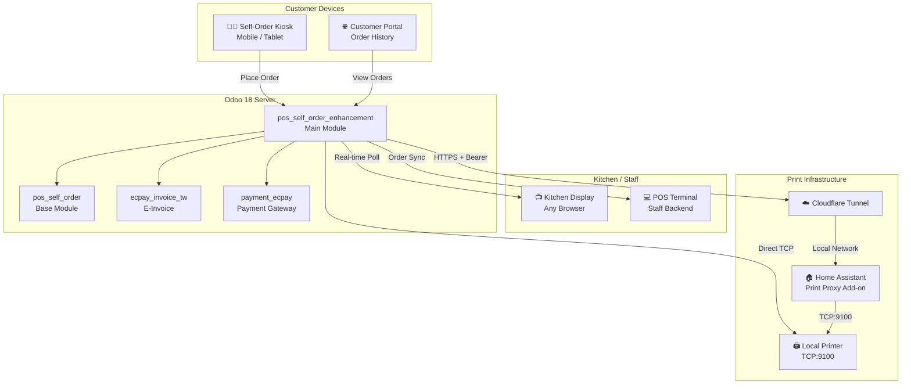
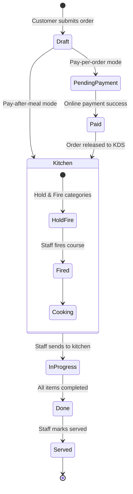
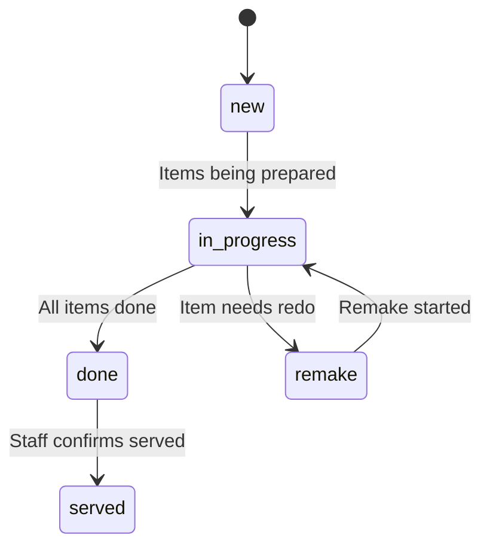
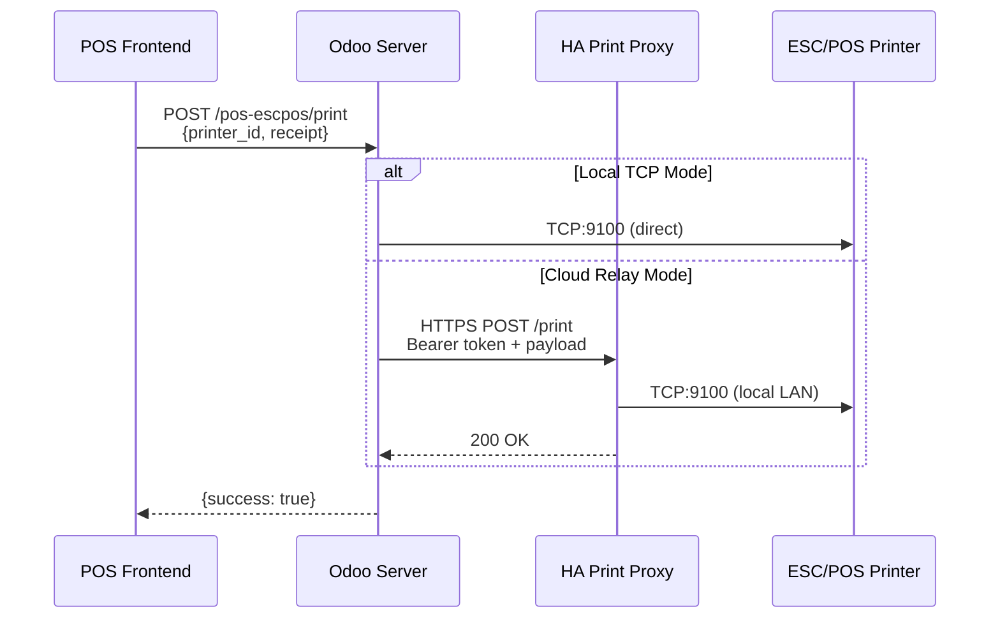
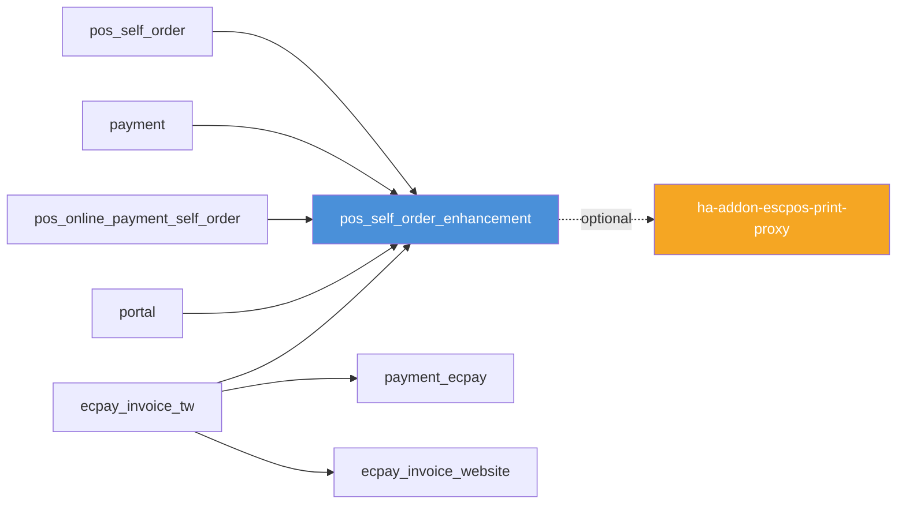

<p align="center">
  
  
  
  
  
  
</p>

<h1 align="center">POS Self Order Enhancement</h1>

<p align="center">
  <strong>Production-ready POS self-ordering suite for Odoo 18</strong><br/>
  Kitchen Display · Cloud Printing · Payment Gating · Taiwan E-Invoice
</p>

<p align="center">
  <a href="#overview">Overview</a> &bull;
  <a href="#features">Features</a> &bull;
  <a href="#architecture">Architecture</a> &bull;
  <a href="#modules">Modules</a> &bull;
  <a href="#screenshots">Screenshots</a> &bull;
  <a href="#installation">Installation</a> &bull;
  <a href="#security">Security</a> &bull;
  <a href="#api-reference">API Reference</a> &bull;
  <a href="#support">Support</a> &bull;
  <a href="#license">License</a> &bull;
  <a href="README_zh-TW.md">繁體中文</a>
</p>

---

## Overview

**POS Self Order Enhancement** is a comprehensive Odoo 18 module that transforms the built-in POS self-ordering system into a full-featured restaurant operation platform. It adds a real-time Kitchen Display Screen (KDS), cloud ESC/POS printing via Home Assistant, payment gating for pay-per-order workflows, and Taiwan MOF-compliant e-invoice integration.

### Why This Module?

| Challenge | Solution |
|-----------|----------|
| No kitchen display in Odoo POS | Real-time KDS with timers, item tracking, and audio alerts — runs on any browser |
| Cloud Odoo can't reach local printers | Cloud relay via Home Assistant add-on + Cloudflare Tunnel |
| Community edition lacks pay-per-order | Payment gating that holds orders until online payment completes |
| Self-order customers can cancel orders | Cancel button removed from kiosk; staff retains full control |
| Taiwan e-invoice compliance is complex | Full MOF integration with carrier types, QR codes, and receipt printing |
| Multi-course timing is manual | Hold & Fire category controls let staff sequence kitchen output |

---

## Features

### Self-Order Enhancements

- **Remove Cancel Button** — Prevents customer cancellation after order submission; staff can still cancel from POS backend
- **Continue Ordering** — "Continue Ordering" button on the landing page lets customers add items to existing unpaid orders
- **Pay Per Order Mode** — Enables Enterprise-only "Each Order" payment mode for Community edition
- **Friendly Payment Page** — Orders grouped by session with localized labels and current-session subtotals
- **Hide Tax Display** — Simplified customer interface without tax line details

### Kitchen Display Screen (KDS)

- **Real-time Order Display** — Standalone HTML5 page with polling; works on any browser or tablet
- **Item-level Tracking** — Strikethrough done items, bump entire orders, recall from history
- **Hold & Fire** — Category-level workflow control; staff fires courses when ready
- **Timer with Color Escalation** — Green → Yellow → Red based on configurable thresholds
- **Audio Chimes** — Distinct sounds for new orders and remake requests
- **Multi-language** — English and Traditional Chinese (zh_TW) built in
- **Token-based Auth** — No login required; access via URL token

### ESC/POS Network Printing

- **Local TCP Mode** — Direct LAN printing to any ESC/POS printer at IP:9100 (no IoT Box needed)
- **Cloud Relay Mode** — Cloud-hosted Odoo prints via Home Assistant add-on + Cloudflare Tunnel
- **Per-printer Paper Width** — 80 mm or 58 mm configurable per printer
- **Multi-printer Labels** — Route print jobs to specific printers (kitchen, invoice, bar)
- **Test Page** — One-click test print from Odoo backend

### Taiwan E-Invoice (ecpay_invoice_tw)

- **MOF Compliant** — Full 統一發票 support via ECPay API
- **Carrier Types** — Print, Mobile Barcode, Donation, B2B (with optional paper copy)
- **QR Code Generation** — Left/right QR codes per MOF specification
- **Invoice Lifecycle** — Issue, void, and reversal workflows
- **POS Receipt Integration** — Invoice data printed directly on ESC/POS receipts

### Customer Portal

- **Order History** — Portal users can view past POS orders
- **Store Picker** — Multi-location support with per-partner shop assignment
- **Payment Retry** — Re-attempt failed online payments from portal

---

## Architecture

### System Overview



### Order Lifecycle



### KDS State Machine



### Print Pipeline



### Module Dependency Graph



---

## Modules

### pos_self_order_enhancement — Main Module

> Core enhancement module that extends Odoo's built-in POS self-ordering system.

| | |
|---|---|
| **Version** | 18.0.1.3.0 |
| **Category** | Sales/Point of Sale |
| **Depends** | `pos_self_order`, `payment`, `pos_online_payment_self_order`, `ecpay_invoice_tw`, `portal` |
| **License** | LGPL-3 |

**Models:**
- `pos.config` — KDS settings, e-invoice config, printer assignments
- `pos.order` — KDS state, payment gating, e-invoice fields, Hold & Fire courses
- `pos.printer` — Network ESC/POS printer (IP, relay URL, API key, paper width, label)
- `pos.category` — Hold & Fire toggle per category
- `res.partner` — Portal POS access and partner-level shop assignment

**Controllers:**
- `kds.py` — Kitchen Display Screen web page and data API
- `orders.py` — Order processing with payment gate logic
- `print_proxy.py` — ESC/POS printing (local TCP or cloud relay)
- `pos_portal.py` — Customer portal for order history

**Frontend (JavaScript/OWL):**
- Self-order kiosk pages (payment, cart, combo, landing, order history)
- POS backend extensions (KDS integration, e-invoice carrier selection, printer selection)
- KDS standalone page (vanilla JS, no OWL dependency)
- Network printer driver (`escpos_network_printer.js`)

---

### ha-addon-escpos-print-proxy — Home Assistant Add-on

> Cloud relay print proxy that bridges cloud Odoo to local ESC/POS printers.

| | |
|---|---|
| **Version** | 0.4.1 |
| **Type** | Home Assistant Add-on (Docker) |
| **Language** | Python (Flask) |

**Features:**
- Multi-printer support with label-based routing
- Per-printer paper width (58 mm / 80 mm)
- Bearer token authentication
- Health check endpoint
- Designed for Cloudflare Tunnel deployment

---

### ecpay_invoice_tw — Taiwan E-Invoice

> MOF-compliant Taiwan electronic invoice module via ECPay API.

**Sub-modules:**
- `ecpay_invoice_tw` — Core e-invoice issuance, void, and carrier management
- `payment_ecpay` — ECPay payment processor integration
- `ecpay_invoice_website` — Website shop e-invoice UI

---

## Screenshots

> **Note:** Screenshots are placeholders. Add your own to `docs/screenshots/` and update paths below.

### Self-Order Kiosk

<!--  -->
<!--  -->
<!--  -->

### Kitchen Display Screen (KDS)

<!--  -->
<!--  -->
<!--  -->

### ESC/POS Printer Configuration

<!--  -->
<!--  -->

### E-Invoice on POS Receipt

<!--  -->

---

## Installation

### Prerequisites

- **Odoo 18.0** (Community or Enterprise)
- **Python 3.10+**
- **PostgreSQL 13+**
- `pos_self_order` module (included in Odoo)

### Step 1: Clone the Repository

```bash
cd /path/to/odoo/addons
git clone https://github.com/WOOWTECH/Odoo_pos_self_checkout_enhance.git pos_self_order_enhancement
```

### Step 2: Install the Module

1. Go to **Apps** menu in Odoo
2. Click **Update Apps List**
3. Search for **"POS Self Order Enhancement"**
4. Click **Install**

### Step 3: Configure POS

1. Navigate to **Point of Sale → Configuration → Settings**
2. Enable desired features:
   - **KDS** — Set access token, configure URL
   - **Self-Order Mode** — Choose "Each Order" for pay-per-order
   - **Network Printers** — Add ESC/POS printers with IP and optional cloud relay

### Step 4 (Optional): Cloud Printing Setup

For cloud-hosted Odoo needing local printer access:

1. Install the Home Assistant Add-on
2. Configure Cloudflare Tunnel to expose the add-on
3. Set `escpos_proxy_url` and `escpos_proxy_api_key` on the printer record in Odoo

### Step 5 (Optional): Taiwan E-Invoice

1. Install `ecpay_invoice_tw` and `payment_ecpay` modules
2. Configure ECPay API credentials in **Settings → E-Invoice**
3. Enable e-invoice on the POS config

---

## Security

### Authentication

| Endpoint | Auth Method | Details |
|----------|-------------|---------|
| Self-order kiosk | Public | No login required (customer-facing) |
| KDS page | URL token | `?token=<access_token>` generated per POS config |
| Print proxy (Odoo) | Odoo session | Requires authenticated Odoo user |
| Print proxy (HA add-on) | Bearer token | `Authorization: Bearer <api_key>` |
| Customer portal | Odoo portal user | Standard Odoo portal authentication |
| POS backend | Odoo internal user | Standard Odoo user session |

### Data Protection

- **API keys stored server-side** — `escpos_proxy_api_key` is never exposed to POS frontend JavaScript
- **Token rotation** — KDS access tokens can be regenerated from POS config at any time
- **Portal isolation** — Portal users only see their own orders; per-partner shop assignment controls access
- **E-invoice credentials** — ECPay API keys stored in `ir.config_parameter` with restricted access

### Network Security

- **Cloud relay uses HTTPS** — All print relay traffic encrypted via Cloudflare Tunnel
- **No inbound ports** — Home Assistant add-on uses outbound-only Cloudflare Tunnel (no port forwarding needed)
- **Local TCP printing** — Direct printer connections stay within the local network

---

## API Reference

### Self-Order Endpoints

| Method | Route | Auth | Description |
|--------|-------|------|-------------|
| POST | `/pos-self-order/process-order/<type>/` | Public | Create or update a self-order |
| POST | `/pos-self-order/select-counter-payment` | Public | Select pay-at-counter option |

### Kitchen Display Screen

| Method | Route | Auth | Description |
|--------|-------|------|-------------|
| GET | `/pos-kds/<config_id>?token=<token>` | Token | KDS web page |
| POST | (JSON-RPC within KDS) | Token | Poll orders, mark done, recall |

### ESC/POS Printing

| Method | Route | Auth | Description |
|--------|-------|------|-------------|
| POST | `/pos-escpos/print` | Session | Print receipt or open cash drawer |

**Request body:**
```json
{
    "action": "print_receipt",
    "printer_id": 1,
    "receipt": "<base64_jpeg>"
}
```

**Actions:** `print_receipt` | `cashbox`

**Printer resolution precedence:**
1. `printer_id` → looks up `pos.printer` record
2. If record has `escpos_proxy_url` → cloud relay mode
3. Otherwise → local TCP mode

### HA Print Proxy Add-on

| Method | Route | Auth | Description |
|--------|-------|------|-------------|
| POST | `/print` | Bearer | Print receipt via local printer |
| GET | `/status` | None | Health check |

**Request body (to add-on):**
```json
{
    "action": "print_receipt",
    "printer_label": "kitchen",
    "paper_width": 80,
    "receipt": "<base64_jpeg>"
}
```

### Customer Portal

| Method | Route | Auth | Description |
|--------|-------|------|-------------|
| GET | `/my/pos-orders/` | Portal | Order history page |
| GET | `/pos-store-picker/` | Portal | Multi-location store selector |

---

## Support

- **Issues:** [GitHub Issues](https://github.com/WOOWTECH/Odoo_pos_self_checkout_enhance/issues)
- **Author:** [WoowTech](https://www.woowtech.com)
- **Website:** [aiot.woowtech.io](https://aiot.woowtech.io/)

---

## License

This module is licensed under the [LGPL-3](https://www.gnu.org/licenses/lgpl-3.0.html).

Copyright © [WoowTech](https://www.woowtech.com)
