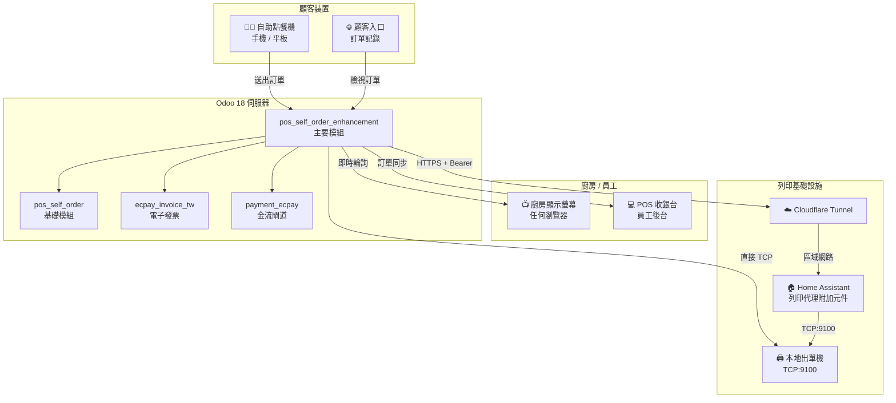
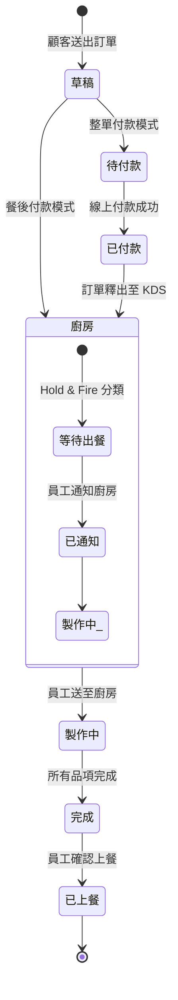
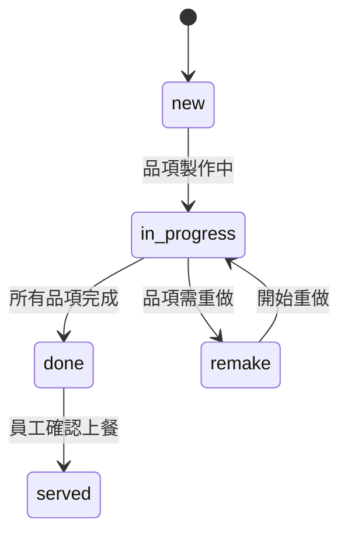
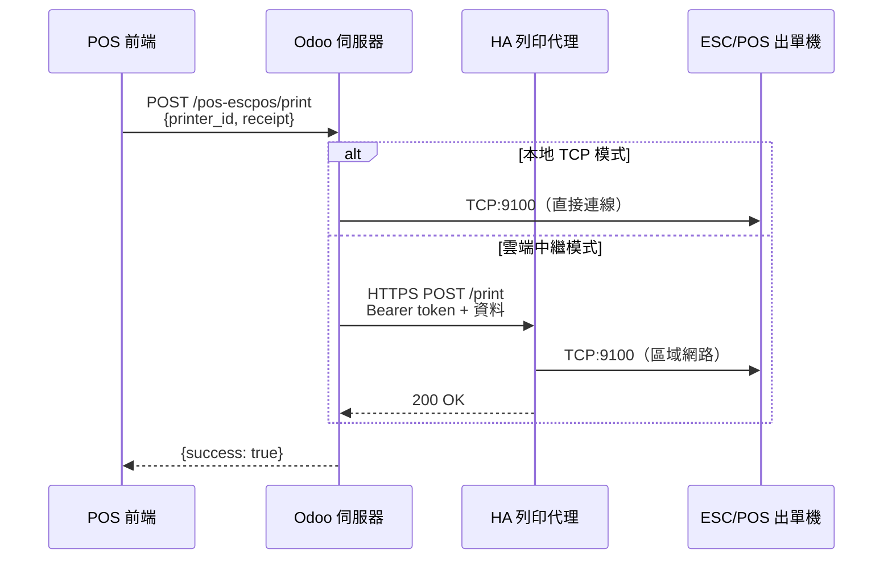
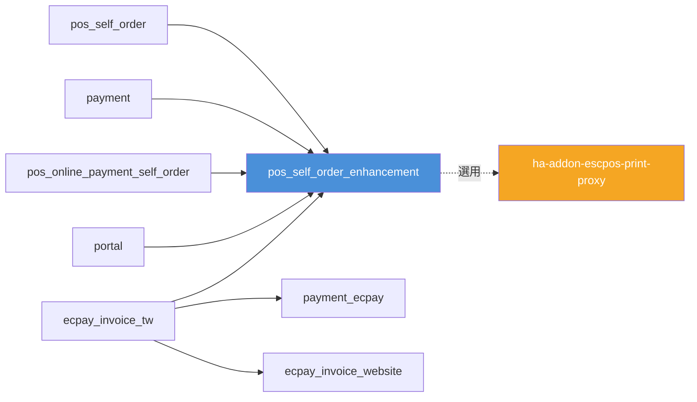

<p align="center">
  
  
  
  
  
  
</p>

<h1 align="center">POS 自助點餐增強模組</h1>

<p align="center">
  <strong>Odoo 18 生產級 POS 自助點餐解決方案</strong><br/>
  廚房顯示螢幕 · 雲端出單 · 付款閘道 · 台灣電子發票
</p>

<p align="center">
  <a href="#概述">概述</a> &bull;
  <a href="#功能特色">功能特色</a> &bull;
  <a href="#系統架構">系統架構</a> &bull;
  <a href="#模組說明">模組說明</a> &bull;
  <a href="#螢幕截圖">螢幕截圖</a> &bull;
  <a href="#安裝指南">安裝指南</a> &bull;
  <a href="#安全性">安全性</a> &bull;
  <a href="#api-參考">API 參考</a> &bull;
  <a href="#支援">支援</a> &bull;
  <a href="#授權條款">授權條款</a> &bull;
  <a href="README.md">English</a>
</p>

---

## 概述

**POS Self Order Enhancement** 是一套完整的 Odoo 18 模組，將內建的 POS 自助點餐系統擴展為功能完備的餐廳營運平台。新增即時廚房顯示螢幕（KDS）、透過 Home Assistant 的雲端 ESC/POS 出單、整單付款閘道機制，以及符合台灣財政部規範的電子發票整合。

### 為什麼需要這個模組？

| 挑戰 | 解決方案 |
|------|----------|
| Odoo POS 沒有廚房顯示功能 | 即時 KDS，具備計時器、品項追蹤、音效提示 — 任何瀏覽器皆可使用 |
| 雲端 Odoo 無法連接本地出單機 | 透過 Home Assistant 附加元件 + Cloudflare Tunnel 的雲端中繼列印 |
| 社群版缺少整單付款功能 | 付款閘道機制，訂單在線上付款完成前暫不送出 |
| 自助點餐顧客可以取消訂單 | 移除自助點餐機取消按鈕；員工保留完整操作權限 |
| 台灣電子發票合規性複雜 | 完整財政部整合，支援載具類型、QR Code 及收據列印 |
| 多道菜出餐時序需手動控制 | Hold & Fire 分類控制讓員工安排廚房出餐順序 |

---

## 功能特色

### 自助點餐增強

- **移除取消按鈕** — 訂單送出後顧客無法自行取消；員工仍可從 POS 後台取消
- **繼續點餐** — 首頁「繼續點餐」按鈕，讓顧客可在現有未付款訂單上繼續加點
- **整單付款模式** — 在社群版啟用企業版專屬的「整單付款」模式
- **友善付款頁面** — 訂單依點餐次序分組，顯示本次加點小計
- **隱藏稅金顯示** — 簡化顧客介面，不顯示稅金明細

### 廚房顯示螢幕（KDS）

- **即時訂單顯示** — 獨立 HTML5 頁面，輪詢更新；支援任何瀏覽器或平板
- **品項級追蹤** — 已完成品項劃線、整單出餐、從歷史記錄召回
- **Hold & Fire** — 分類級工作流程控制；員工決定何時通知廚房開始製作
- **計時器顏色提示** — 依可設定閾值，從綠色 → 黃色 → 紅色漸變
- **音效提醒** — 新訂單和重做要求有不同提示音
- **多語系** — 內建英文及繁體中文（zh_TW）
- **Token 認證** — 無需登入；透過 URL Token 存取

### ESC/POS 網路出單機

- **本地 TCP 模式** — 直接透過區域網路列印至任何 ESC/POS 出單機（IP:9100），無需 IoT Box
- **雲端中繼模式** — 雲端 Odoo 透過 Home Assistant 附加元件 + Cloudflare Tunnel 列印
- **每台出單機紙寬設定** — 可依出單機個別設定 80 mm 或 58 mm
- **多出單機標籤** — 依標籤將列印任務路由至指定出單機（廚房、發票、吧台）
- **測試頁** — 從 Odoo 後台一鍵測試列印

### 台灣電子發票（ecpay_invoice_tw）

- **符合財政部規範** — 透過綠界 API 的完整統一發票支援
- **載具類型** — 列印、手機條碼、捐贈、B2B（可選紙本）
- **QR Code 生成** — 依財政部規格產生左右 QR Code
- **發票生命週期** — 開立、作廢及折讓流程
- **POS 收據整合** — 發票資料直接列印在 ESC/POS 收據上

### 顧客入口

- **訂單記錄** — 入口網站使用者可檢視歷史 POS 訂單
- **店鋪選擇** — 多據點支援，依合作夥伴分配店鋪
- **重新付款** — 從入口網站重新嘗試失敗的線上付款

---

## 系統架構

### 系統總覽



### 訂單生命週期



### KDS 狀態機



### 列印流程



### 模組相依圖



---

## 模組說明

### pos_self_order_enhancement — 主要模組

> 擴展 Odoo 內建 POS 自助點餐系統的核心增強模組。

| | |
|---|---|
| **版本** | 18.0.1.3.0 |
| **分類** | 銷售/銷售點 |
| **相依** | `pos_self_order`, `payment`, `pos_online_payment_self_order`, `ecpay_invoice_tw`, `portal` |
| **授權** | LGPL-3 |

**資料模型：**
- `pos.config` — KDS 設定、電子發票設定、出單機指派
- `pos.order` — KDS 狀態、付款閘道、電子發票欄位、Hold & Fire 課程
- `pos.printer` — 網路 ESC/POS 出單機（IP、中繼 URL、API 金鑰、紙寬、標籤）
- `pos.category` — 每個分類的 Hold & Fire 開關
- `res.partner` — 入口網站 POS 存取及合作夥伴店鋪指派

**控制器：**
- `kds.py` — 廚房顯示螢幕網頁及資料 API
- `orders.py` — 含付款閘道邏輯的訂單處理
- `print_proxy.py` — ESC/POS 列印（本地 TCP 或雲端中繼）
- `pos_portal.py` — 顧客入口訂單記錄

**前端（JavaScript/OWL）：**
- 自助點餐機頁面（付款、購物車、套餐、首頁、訂單記錄）
- POS 後台擴展（KDS 整合、電子發票載具選擇、出單機選擇）
- KDS 獨立頁面（原生 JS，不依賴 OWL 框架）
- 網路出單機驅動程式（`escpos_network_printer.js`）

---

### ha-addon-escpos-print-proxy — Home Assistant 附加元件

> 橋接雲端 Odoo 與本地 ESC/POS 出單機的雲端中繼列印代理。

| | |
|---|---|
| **版本** | 0.4.1 |
| **類型** | Home Assistant 附加元件（Docker） |
| **語言** | Python（Flask） |

**功能：**
- 多出單機支援，依標籤路由
- 每台出單機紙寬設定（58 mm / 80 mm）
- Bearer Token 認證
- 健康檢查端點
- 專為 Cloudflare Tunnel 部署設計

---

### ecpay_invoice_tw — 台灣電子發票

> 透過綠界 API 的財政部合規台灣電子發票模組。

**子模組：**
- `ecpay_invoice_tw` — 電子發票開立、作廢及載具管理
- `payment_ecpay` — 綠界金流整合
- `ecpay_invoice_website` — 網站商店電子發票 UI

---

## 螢幕截圖

> **備註：** 螢幕截圖為預留位置。請將您的截圖放入 `docs/screenshots/` 並更新下方路徑。

### 自助點餐機

<!--  -->
<!--  -->
<!--  -->

### 廚房顯示螢幕（KDS）

<!--  -->
<!--  -->
<!--  -->

### ESC/POS 出單機設定

<!--  -->
<!--  -->

### POS 收據電子發票

<!--  -->

---

## 安裝指南

### 系統需求

- **Odoo 18.0**（社群版或企業版）
- **Python 3.10+**
- **PostgreSQL 13+**
- `pos_self_order` 模組（Odoo 內建）

### 步驟一：複製儲存庫

```bash
cd /path/to/odoo/addons
git clone https://github.com/WOOWTECH/Odoo_pos_self_checkout_enhance.git pos_self_order_enhancement
```

### 步驟二：安裝 Python 相依套件

```bash
pip install Pillow  # ESC/POS 收據影像生成所需
```

### 步驟三：安裝模組

1. 前往 Odoo **應用程式**選單
2. 點擊**更新應用程式清單**
3. 搜尋 **「POS Self Order Enhancement」**
4. 點擊**安裝**

### 步驟四：設定 POS

1. 前往**銷售點 → 設定 → 設定**
2. 啟用所需功能：
   - **KDS** — 設定存取 Token、設定 URL
   - **自助點餐模式** — 選擇「整單付款」模式
   - **網路出單機** — 新增 ESC/POS 出單機，設定 IP 及選用雲端中繼

### 步驟五（選用）：雲端列印設定

適用於需要存取本地出單機的雲端 Odoo：

1. 安裝 Home Assistant 附加元件
2. 設定 Cloudflare Tunnel 以公開附加元件
3. 在 Odoo 出單機記錄中設定 `escpos_proxy_url` 和 `escpos_proxy_api_key`

### 步驟六（選用）：台灣電子發票

1. 安裝 `ecpay_invoice_tw` 和 `payment_ecpay` 模組
2. 在**設定 → 電子發票**中設定綠界 API 憑證
3. 在 POS 設定中啟用電子發票

---

## 安全性

### 認證方式

| 端點 | 認證方式 | 說明 |
|------|----------|------|
| 自助點餐機 | 公開 | 無需登入（顧客面向） |
| KDS 頁面 | URL Token | 每個 POS 設定產生 `?token=<access_token>` |
| 列印代理（Odoo） | Odoo Session | 需已認證的 Odoo 使用者 |
| 列印代理（HA 附加元件） | Bearer Token | `Authorization: Bearer <api_key>` |
| 顧客入口 | Odoo 入口使用者 | 標準 Odoo 入口認證 |
| POS 後台 | Odoo 內部使用者 | 標準 Odoo 使用者 Session |

### 資料保護

- **API 金鑰存放於伺服器端** — `escpos_proxy_api_key` 不會暴露給 POS 前端 JavaScript
- **Token 輪換** — KDS 存取 Token 可隨時從 POS 設定重新產生
- **入口隔離** — 入口使用者只能看到自己的訂單；依合作夥伴的店鋪指派控制存取
- **電子發票憑證** — 綠界 API 金鑰存放於 `ir.config_parameter`，具限制存取權限

### 網路安全

- **雲端中繼使用 HTTPS** — 所有列印中繼流量透過 Cloudflare Tunnel 加密
- **無需開放入站連接埠** — Home Assistant 附加元件使用僅出站的 Cloudflare Tunnel（無需通訊埠轉發）
- **本地 TCP 列印** — 直接出單機連線僅在區域網路內

---

## API 參考

### 自助點餐端點

| 方法 | 路由 | 認證 | 說明 |
|------|------|------|------|
| POST | `/pos-self-order/process-order/<type>/` | 公開 | 建立或更新自助訂單 |
| POST | `/pos-self-order/select-counter-payment` | 公開 | 選擇臨櫃付款 |

### 廚房顯示螢幕

| 方法 | 路由 | 認證 | 說明 |
|------|------|------|------|
| GET | `/pos-kds/<config_id>?token=<token>` | Token | KDS 網頁 |
| POST | （KDS 內 JSON-RPC） | Token | 輪詢訂單、標記完成、召回 |

### ESC/POS 列印

| 方法 | 路由 | 認證 | 說明 |
|------|------|------|------|
| POST | `/pos-escpos/print` | Session | 列印收據或開啟錢箱 |

**請求內容：**
```json
{
    "action": "print_receipt",
    "printer_id": 1,
    "receipt": "<base64_jpeg>"
}
```

**動作類型：** `print_receipt` | `cashbox`

**出單機解析優先順序：**
1. `printer_id` → 查詢 `pos.printer` 記錄
2. 若記錄有 `escpos_proxy_url` → 雲端中繼模式
3. 否則 → 本地 TCP 模式

### HA 列印代理附加元件

| 方法 | 路由 | 認證 | 說明 |
|------|------|------|------|
| POST | `/print` | Bearer | 透過本地出單機列印收據 |
| GET | `/status` | 無 | 健康檢查 |

**請求內容（至附加元件）：**
```json
{
    "action": "print_receipt",
    "printer_label": "kitchen",
    "paper_width": 80,
    "receipt": "<base64_jpeg>"
}
```

### 顧客入口

| 方法 | 路由 | 認證 | 說明 |
|------|------|------|------|
| GET | `/my/pos-orders/` | 入口 | 訂單記錄頁面 |
| GET | `/pos-store-picker/` | 入口 | 多據點店鋪選擇 |

---

## 支援

- **問題回報：** [GitHub Issues](https://github.com/WOOWTECH/Odoo_pos_self_checkout_enhance/issues)
- **作者：** [WoowTech](https://www.woowtech.com)
- **網站：** [aiot.woowtech.io](https://aiot.woowtech.io/)

---

## 授權條款

本模組採用 [LGPL-3](https://www.gnu.org/licenses/lgpl-3.0.html) 授權。

Copyright © [WoowTech](https://www.woowtech.com)
