# POS Self Order Enhancement -- User Manual

**Module:** pos_self_order_enhancement v18.0.1.3.0
**Platform:** Odoo 18.0 (Community or Enterprise)
**Author:** WoowTech

---

## Table of Contents

- [Chapter 1: Self-Order Enhancements](#chapter-1-self-order-enhancements)
  - [1.1 Remove Cancel Button](#11-remove-cancel-button)
  - [1.2 Continue Ordering](#12-continue-ordering)
  - [1.3 Pay Per Order Mode](#13-pay-per-order-mode)
  - [1.4 Pay at Counter](#14-pay-at-counter)
  - [1.5 Friendly Payment Page](#15-friendly-payment-page)
  - [1.6 Hide Tax Display](#16-hide-tax-display)
  - [1.7 Sold Out (86)](#17-sold-out-86)
- [Chapter 2: Kitchen Display Screen (KDS)](#chapter-2-kitchen-display-screen-kds)
  - [2.1 Real-time Order Display](#21-real-time-order-display)
  - [2.2 Item-level Tracking](#22-item-level-tracking)
  - [2.3 Items Overview (All-Day)](#23-items-overview-all-day)
  - [2.4 Hold and Fire](#24-hold-and-fire)
  - [2.5 Send Back / Remake](#25-send-back--remake)
  - [2.6 Served Tracking](#26-served-tracking)
  - [2.7 Combo Visualization](#27-combo-visualization)
  - [2.8 Batch Operations](#28-batch-operations)
  - [2.9 Timer with Color Escalation](#29-timer-with-color-escalation)
  - [2.10 Audio Chimes](#210-audio-chimes)
  - [2.11 Multi-language](#211-multi-language)
  - [2.12 Token-based Auth](#212-token-based-auth)
  - [2.13 Dashboard Badge](#213-dashboard-badge)
- [Chapter 3: ESC/POS Network Printing](#chapter-3-escpos-network-printing)
  - [3.1 Local TCP Mode](#31-local-tcp-mode)
  - [3.2 Cloud Relay Mode](#32-cloud-relay-mode)
  - [3.3 Per-printer Paper Width](#33-per-printer-paper-width)
  - [3.4 Multi-printer Labels](#34-multi-printer-labels)
  - [3.5 Test Page](#35-test-page)
- [Chapter 4: Taiwan E-Invoice](#chapter-4-taiwan-e-invoice)
  - [4.1 MOF Compliant](#41-mof-compliant)
  - [4.2 Carrier Types](#42-carrier-types)
  - [4.3 QR Code Generation](#43-qr-code-generation)
  - [4.4 Invoice Lifecycle](#44-invoice-lifecycle)
  - [4.5 Auto Issuance](#45-auto-issuance)
  - [4.6 Tax ID Lookup](#46-tax-id-lookup)
  - [4.7 POS Receipt Integration](#47-pos-receipt-integration)
- [Chapter 5: Portal POS Access](#chapter-5-portal-pos-access)
  - [5.1 Admin Setup: Grant Portal User Access to POS](#51-admin-setup-grant-portal-user-access-to-pos)
  - [5.2 Portal User: Access POS from /my Page](#52-portal-user-access-pos-from-my-page)

---

## Chapter 1: Self-Order Enhancements

This chapter covers the seven features that improve the customer-facing self-order kiosk experience.

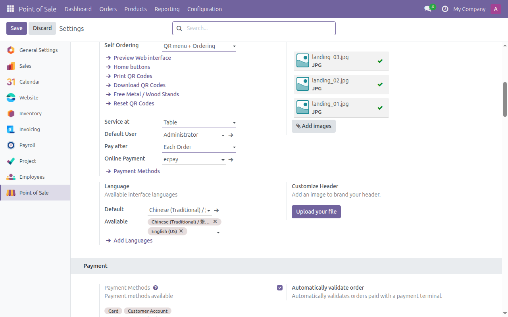

---

### 1.1 Remove Cancel Button

Prevents customers from cancelling their order after submission. Staff retains full cancel authority from the POS backend.

**Setup**

1. No configuration required. This feature is automatically enabled when the module is installed.
2. Verify by opening the self-order kiosk on a customer device -- the cancel button should no longer appear after an order is submitted.

**Usage**

- Customers place their order through the kiosk as normal.
- After submission, customers cannot cancel or modify the order from the kiosk.
- If a customer requests a cancellation, staff handles it from the POS backend terminal by selecting the order and using the standard Odoo cancel workflow.

**Troubleshooting**

- If the cancel button still appears, ensure the module `pos_self_order_enhancement` is installed and up to date. Go to Apps, search for the module, and verify it shows "Installed."
- Clear the browser cache on the kiosk device if the old interface persists.
- Confirm that the kiosk is loading from the correct Odoo instance where the module is installed.

---

### 1.2 Continue Ordering

Displays a "Continue Ordering" button on the self-order landing page when the customer has an existing unpaid order in the current session.

**Setup**

1. No configuration required. This feature is automatically enabled upon module installation.

**Usage**

- A customer places an order on the kiosk but does not pay immediately.
- When the same customer (same browser session) returns to the landing page, a "Continue Ordering" button appears.
- Clicking "Continue Ordering" brings the customer back to their existing unpaid order where they can add more items before proceeding to payment.

**Troubleshooting**

- The button only appears when there is an unpaid order in the current POS session. If the POS session has been closed and reopened, previous orders no longer qualify.
- If the customer uses a different browser or clears cookies, the association with the previous order is lost.
- Ensure the kiosk device does not clear browser data between customers (unless that is the intended behavior).

---

### 1.3 Pay Per Order Mode

Enables a payment gating workflow where each order is held until online payment completes. This makes the Enterprise-only "Each Order" payment mode available for Community edition.

**Setup**

1. Navigate to **Point of Sale > Configuration > Settings**.
2. Under the **Mobile self-order & Kiosk** section, find the **Pay after** setting.
3. Set it to **"Each Order"**.
4. Ensure you have at least one online payment method configured (e.g., ECPay, Stripe).
5. Save the configuration.

**Usage**

- When a customer submits an order on the kiosk, the order is placed in a "pending payment" state.
- The customer is directed to the online payment page.
- The order is only released to the POS (and subsequently to the kitchen) after payment succeeds.
- Staff can see pending-payment orders in the POS backend.

**Payment Flow by Scenario**

#### Scenario A: Pay after Each Order + Online Payment (ECPay)
1. Customer places order on kiosk. The order is created as draft with status `pending_online`.
2. Customer is redirected to the ECPay payment page.
3. Payment succeeds. The order status becomes `paid` and the order is auto-sent to the kitchen.
4. All Hold & Fire categories are auto-fired (no manual fire needed).
5. KDS shows the order. Kitchen staff marks items done. Order status becomes `done`.
6. POS floor screen shows a **"Ready"** badge on the table.
7. POS staff clicks **"Served"**. The order is marked as served and removed from active displays.

#### Scenario B: Pay after Each Order + Pay at Counter
1. Customer places order. Status is `pending_online`.
2. Customer clicks **"Pay at Counter"**. Status becomes `pending_counter`.
3. POS floor screen shows a **"Counter Pay"** badge (orange $ icon) on the table.
4. Staff opens the table, processes payment at the register.
5. Order is sent to kitchen. Same KDS lifecycle as Scenario A (auto-fire enabled).

#### Scenario C: Pay after Meal + Online Payment (ECPay)
1. Customer places order. The order is immediately visible to POS and kitchen (no payment gate).
2. Hold & Fire categories remain **held** -- staff fires courses manually from POS.
3. Customer can continue ordering (add more items to the same table).
4. When ready to leave, customer pays via ECPay online payment.
5. E-invoice is auto-issued after payment confirmation.

#### Scenario D: Pay after Meal + Pay at Counter
1. Customer places order. The order is immediately visible to POS and kitchen.
2. Hold & Fire categories remain held -- staff fires courses manually.
3. Customer adds more items as desired.
4. Customer goes to the counter to pay when finished.
5. Staff processes payment at the POS register.

**Troubleshooting**

- If orders go straight to the kitchen without payment, verify that Pay After is set to "Each Order" and not "Meal."
- Ensure the online payment provider is correctly configured and active.
- Check that the payment method is assigned to the POS config.

---

### 1.4 Pay at Counter

Allows customers to choose to pay at the physical POS counter instead of paying online. The order is released to the POS terminal for staff to collect payment.

**Setup**

1. This option is available in both payment modes ("Each Order" and "Meal").
2. No additional configuration is needed.

**Usage**

- After placing an order, the customer sees the payment screen.
- The customer selects **"Pay at Counter"** instead of proceeding with online payment.
- The order is released to the POS backend for the staff to process.
- Staff locates the order in the POS terminal and collects payment using any method available (cash, card, etc.).

**Troubleshooting**

- If the "Pay at Counter" option does not appear, ensure the POS session is open so that released orders can be received by staff.
- If the order does not appear on the staff terminal, check that the kiosk and POS terminal are using the same POS configuration.

---

### 1.5 Friendly Payment Page

Improves the payment page layout by grouping orders by session with localized labels and showing current-session subtotals.

**Setup**

1. No configuration required. This feature is automatically enabled upon module installation.

**Usage**

- When customers proceed to payment, they see a clean, organized summary.
- Orders are grouped by session with subtotals displayed for the current session.
- Labels are localized to the customer's language setting.

**Troubleshooting**

- If the payment page appears unstyled or shows the default Odoo layout, ensure the module is installed and the browser cache is cleared.
- Verify that the POS config has the correct language settings for localized labels.

---

### 1.6 Hide Tax Display

Removes tax line details from the customer-facing cart page to provide a simplified interface.

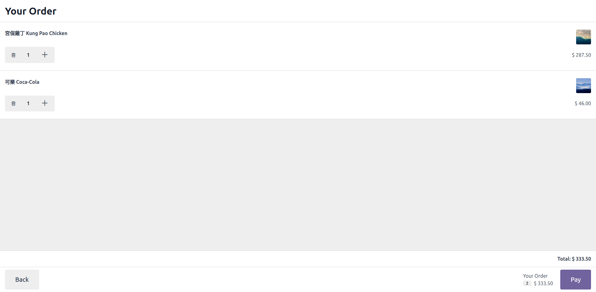

**Setup**

1. No configuration required. This feature is automatically enabled upon module installation.

**Usage**

- When customers view their cart on the kiosk, tax breakdown lines are hidden.
- The total price shown to the customer includes tax but does not itemize it.
- Tax calculations remain fully functional internally for accounting and invoice purposes.

**Troubleshooting**

- If tax lines still appear in the cart, clear the kiosk browser cache and reload.
- This feature only affects the self-order kiosk cart page; the POS backend and receipts continue to show tax details as configured.

---

### 1.7 Sold Out (86)

Allows staff to temporarily mark products as unavailable ("86'd"). The status syncs to the kiosk in real time and automatically resets when the POS session closes.

**Setup**

1. No special configuration is required. The feature is available in the POS backend once the module is installed.

**Usage**

1. In the POS backend, locate the product you want to mark as sold out.
2. Toggle the **Sold Out** status on the product.
3. The product immediately becomes unavailable on all connected self-order kiosks.
4. Customers browsing the kiosk will see the product marked as sold out and will be unable to add it to their cart.
5. When the POS session is closed, all sold-out statuses are automatically reset.

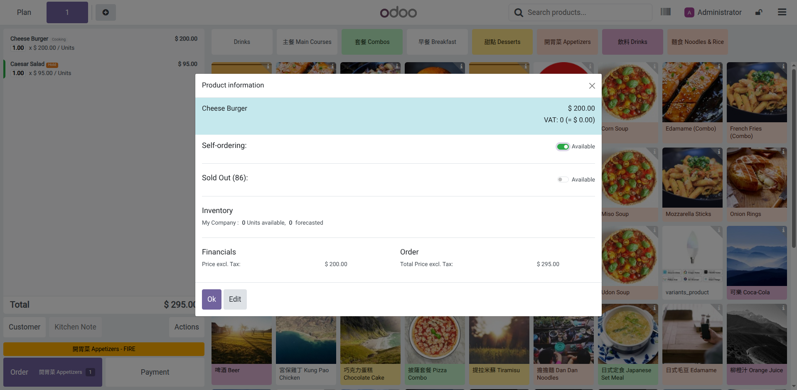

**Troubleshooting**

- If the product still appears available on the kiosk after marking it sold out, check that the kiosk is polling the correct POS session.
- Ensure the kiosk browser has an active network connection to the Odoo server.
- If sold-out status does not reset after session close, verify that the session was fully closed (not just locked).

---

## Chapter 2: Kitchen Display Screen (KDS)

The KDS is a standalone HTML5 page that displays incoming orders in real time. It runs in any modern browser and is designed for kitchen tablets, wall-mounted displays, or any screen accessible to kitchen staff.

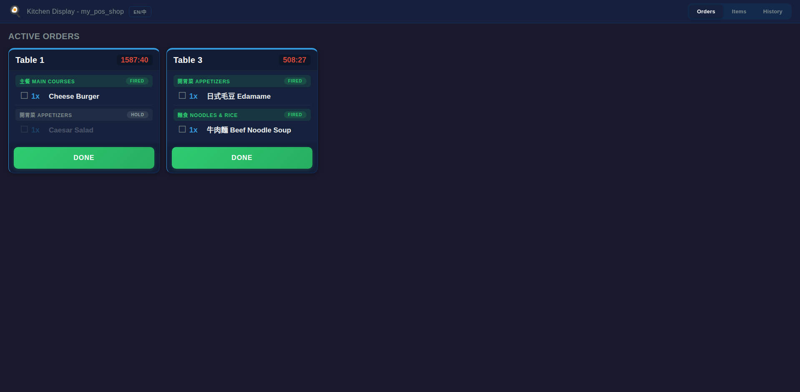

---

### 2.1 Real-time Order Display

Provides a standalone KDS page that polls the Odoo server for new orders and displays them as order cards.

**Setup**

1. Navigate to **Point of Sale > Configuration > Point of Sales** > select your shop > scroll to the **Kitchen Display Screen (KDS)** section.
2. Find the **Kitchen Display Screen** section.
3. Enable the KDS feature.
4. An access URL with a token is generated. Copy this URL.
5. Open the URL in a browser on your kitchen display device (tablet, monitor, etc.).

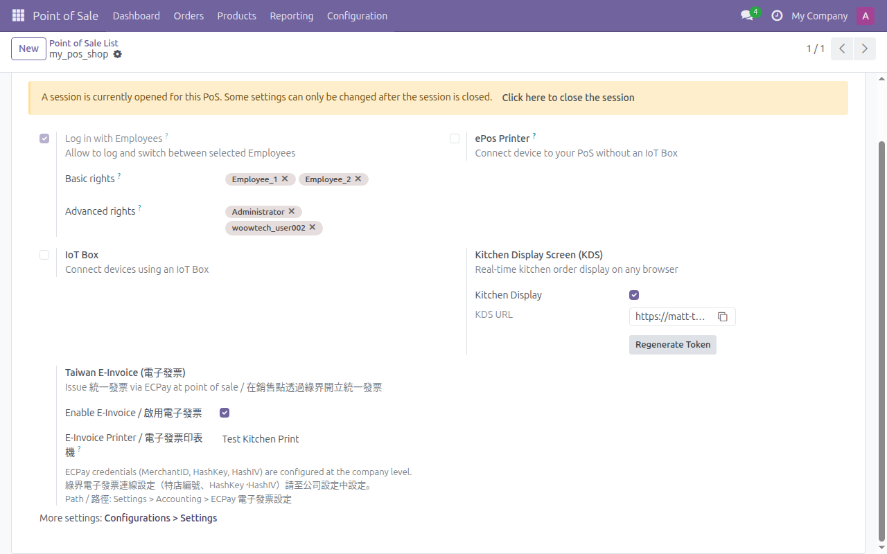

**Usage**

- Orders submitted from the self-order kiosk or POS terminal appear automatically on the KDS.
- Each order is shown as a card with the order number, items, quantities, and elapsed time.
- The page polls for updates periodically -- no manual refresh is needed.

**Troubleshooting**

- If no orders appear, confirm the POS session is open and orders are being placed against the same POS configuration.
- Check that the KDS URL token matches the one configured in the POS settings. If in doubt, regenerate the token.
- Ensure the device running the KDS has network access to the Odoo server.
- If the page shows a loading error, check that the browser supports modern JavaScript (Chrome, Firefox, Edge, or Safari).

---

### 2.2 Item-level Tracking

Allows kitchen staff to track individual items within an order. Items can be marked as done (strikethrough), entire orders can be bumped, and completed orders can be recalled from history.

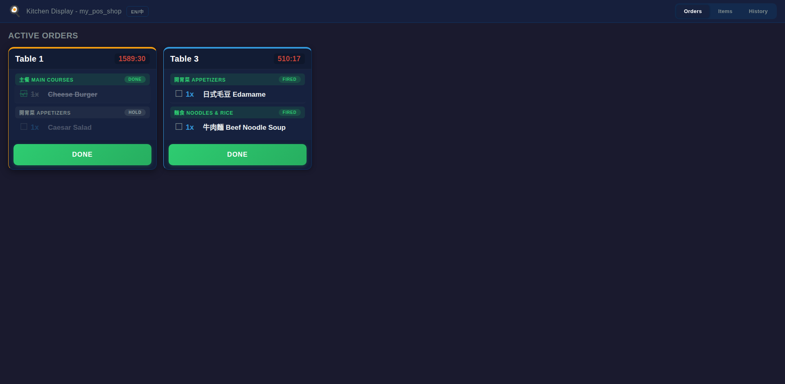

**Setup**

1. No additional configuration beyond enabling the KDS (section 2.1).

**Usage**

- On the KDS, click an individual item to toggle its done status. Done items appear with a strikethrough.
- When all items in an order are done, use the **Bump** button to move the order to the completed/history list.
- To recall a completed order (e.g., if an item was missed), open the history tab and select the order to bring it back to the active view.

**Troubleshooting**

- If clicking an item does not toggle its status, ensure the browser is not in a restricted mode (e.g., kiosk mode with touch disabled).
- If recalled orders do not reappear, refresh the KDS page.

---

### 2.3 Items Overview (All-Day)

Shows an aggregated count of all products across all active orders, useful for prep planning.

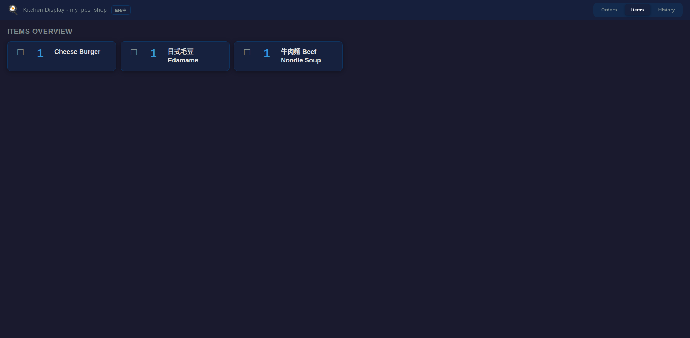

**Setup**

1. No additional configuration beyond enabling the KDS (section 2.1).

**Usage**

- On the KDS page, switch to the **Items** tab.
- The view shows every product currently needed across all active orders with a total count.
- Use this view at the start of a shift or during busy periods to plan batch preparation.

**Troubleshooting**

- Counts only reflect active (non-completed) orders. If numbers seem low, check whether orders have been bumped to history.
- The items view updates on the same polling cycle as the order view.

---

### 2.4 Hold and Fire

Enables course-level workflow control. Products assigned to a "Hold & Fire" category are held back until staff explicitly fires them, allowing timed course delivery (e.g., starters first, then mains, then desserts).

**Setup**

1. Navigate to **Point of Sale > Configuration > PoS Product Categories**.
2. Select or create the category for the course you want to control (e.g., "Mains," "Desserts").
3. Enable the **KDS Hold & Fire** checkbox on the category.
4. Assign products to this category as needed.
5. Save the configuration.

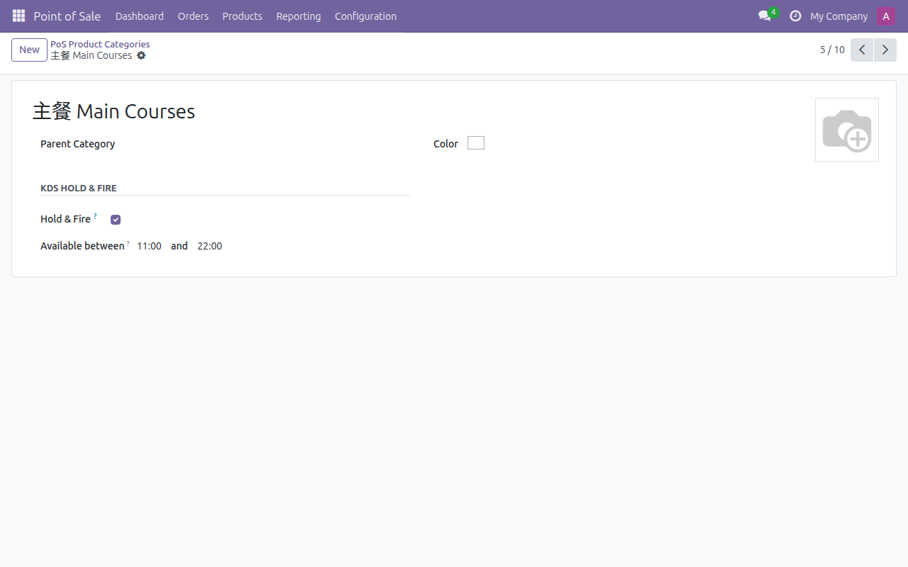

**Usage**

1. When an order comes in, items in Hold & Fire categories appear on the KDS with a "Hold" status.
2. Items without Hold & Fire are sent to the kitchen immediately.
3. When staff is ready to prepare the next course, they go to the POS backend and **fire** the held course.
4. Fired items then appear as active on the KDS for kitchen preparation.

> **Important:** When "Pay after Each Order" mode is enabled, Hold & Fire categories automatically become auto-fire. Once payment is confirmed, ALL held categories are fired to the kitchen immediately -- no manual "Fire" button click is needed. This is because in pay-per-order mode there is no cashier present to sequence courses manually.
>
> In "Pay after Meal" mode, Hold & Fire works as normal -- staff must manually fire each course from the POS terminal.

**Troubleshooting**

- If items are not being held, verify the category has the "KDS Hold & Fire" checkbox enabled.
- Ensure the products are assigned to the correct Hold & Fire category.
- Combo items follow a child-first rule: each combo child uses its own category's Hold & Fire setting, not the parent's.
- If fired items do not appear on the KDS, check that the POS session is connected and the KDS is actively polling.

---

### 2.5 Send Back / Remake

Allows POS staff to send items back to the kitchen with a reason. The item reappears on the KDS with a remake badge and reason text.

**Setup**

1. No additional configuration beyond enabling the KDS (section 2.1).

**Usage**

1. In the POS backend, select the order containing the item to be remade.
2. Click **Send Back** on the item.
3. Enter the reason for the remake (e.g., "wrong temperature," "customer changed mind").
4. The item reappears on the KDS with a visible remake badge and the reason text.
5. The KDS plays a distinct audio chime to alert kitchen staff of the remake.

**Troubleshooting**

- If the remake badge does not appear on the KDS, check that the KDS page is actively polling and connected.
- Ensure audio is enabled on the KDS device to hear the remake chime (see section 2.10).

---

### 2.6 Served Tracking

Allows POS staff to mark individual items or entire orders as served to the customer's table.

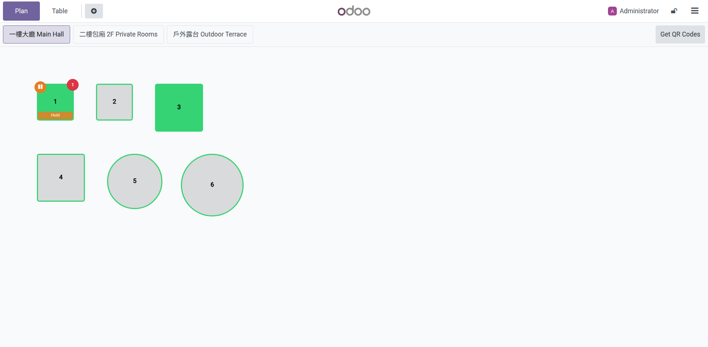

**Setup**

1. No additional configuration beyond enabling the KDS (section 2.1).

**Usage**

1. In the POS backend, select the order that has been delivered to the table.
2. Click **Served** and select the items that have been served, or mark the entire order.
3. The served status is reflected on the KDS and in order history.

**Troubleshooting**

- If the "Served" option is not visible, ensure the module is installed and the POS session is active.
- Served status is a terminal state -- items cannot be "un-served" without recalling the order.

---

### 2.7 Combo Visualization

Displays combo (meal deal) orders on the KDS with the parent item and its child components clearly grouped with indentation.

**Setup**

1. No additional configuration. Combo visualization works automatically when combo products are configured in Odoo POS.

**Usage**

- When a combo order appears on the KDS, the parent product (e.g., "Lunch Combo") is shown as the header.
- Child items (e.g., "Burger," "Fries," "Drink") are indented beneath the parent.
- Each child item can be individually tracked (marked done) just like any other item.

**Troubleshooting**

- If combo items appear as flat (non-grouped) items, ensure the products are configured as combos in Odoo POS, not as individual products.
- Combo children follow the child-first rule for Hold & Fire: each child uses its own category's Hold & Fire setting.

---

### 2.8 Batch Operations

Allows kitchen staff to mark all instances of the same product as done across all orders at once, useful for batch cooking.

**Setup**

1. No additional configuration beyond enabling the KDS (section 2.1).

**Usage**

1. On the KDS, switch to the **Items** tab.
2. Click on a product name (e.g., "French Fries").
3. All instances of that product across all active orders are marked as done simultaneously.

**Troubleshooting**

- This operation affects all active orders. Use with care if different orders have different timing requirements.
- If some items are not marked, they may belong to orders that are in a "Hold" state (see section 2.4).

---

### 2.9 Timer with Color Escalation

Each order card on the KDS displays an elapsed time timer that changes color based on how long the order has been waiting.

**Setup**

1. No additional configuration. The timer is built into the KDS display.

**Usage**

- **Green** -- The order is within the acceptable preparation window.
- **Yellow** -- The order is approaching the threshold and needs attention.
- **Red** -- The order has exceeded the expected preparation time and requires immediate action.

**Troubleshooting**

- Timer colors are determined by built-in thresholds. If all orders appear red immediately, check that the KDS device's system clock is synchronized correctly.
- The timer starts from the moment the order is received by the KDS.

---

### 2.10 Audio Chimes

The KDS plays distinct audio sounds when new orders arrive and when remake requests are received.

**Setup**

1. No configuration required. Audio chimes are built into the KDS page.
2. The first time the KDS page is loaded, the browser may block audio playback until the user interacts with the page. Click anywhere on the KDS page to enable audio.

**Usage**

- A chime plays automatically when a new order appears on the KDS.
- A different chime plays when a remake/send-back item is received.
- These audio alerts help kitchen staff notice new work without constantly watching the screen.

**Troubleshooting**

- If no sound plays, click anywhere on the KDS page to satisfy the browser's autoplay policy. Most browsers require at least one user interaction before playing audio.
- Check that the device volume is turned up and not muted.
- Verify the browser is not blocking audio for the site (check browser permissions).

---

### 2.11 Multi-language

The KDS interface supports English and Traditional Chinese (zh_TW) with a built-in language toggle.

**Setup**

1. No additional configuration. The language toggle is available directly on the KDS page.

**Usage**

- On the KDS page, use the language toggle (EN / zh_TW) to switch the interface language.
- Product names and order details display according to the language configured in Odoo for each product.

**Troubleshooting**

- If product names do not change when switching languages, ensure that product translations are configured in Odoo under the product's translation settings.
- The language toggle only affects KDS interface labels, not product data that lacks translations.

---

### 2.12 Token-based Auth

The KDS page is secured with a URL token. No Odoo login is required -- anyone with the correct URL can access the KDS.

**Setup**

1. Navigate to **Point of Sale > Configuration > Point of Sale** and select your POS config.
2. In the **Kitchen Display Screen** section, a token is automatically generated.
3. To regenerate the token (e.g., if it was compromised), click the **Regenerate Token** button.
4. Copy the full KDS URL including the `?token=...` parameter and distribute it to authorized devices.

**Usage**

- Open the KDS URL in a browser. The token in the URL authenticates access.
- No username or password is needed.
- Bookmark the URL on kitchen devices for quick access.

**Troubleshooting**

- If the KDS page returns an authentication error, the token may have been regenerated. Obtain the new URL from the POS config.
- Do not share the KDS URL publicly. Anyone with the URL can view orders.
- If you suspect unauthorized access, regenerate the token immediately from the POS config.

---

### 2.13 Dashboard Badge

Adds a KDS shortcut badge to the POS kanban dashboard card, allowing quick access to the KDS from the POS overview.

**Setup**

1. Enable the KDS on the POS config (section 2.1). The badge appears automatically.

**Usage**

- On the **Point of Sale** dashboard (kanban view), each POS config card that has KDS enabled shows a KDS badge.
- Click the badge to open the KDS page directly in a new tab.

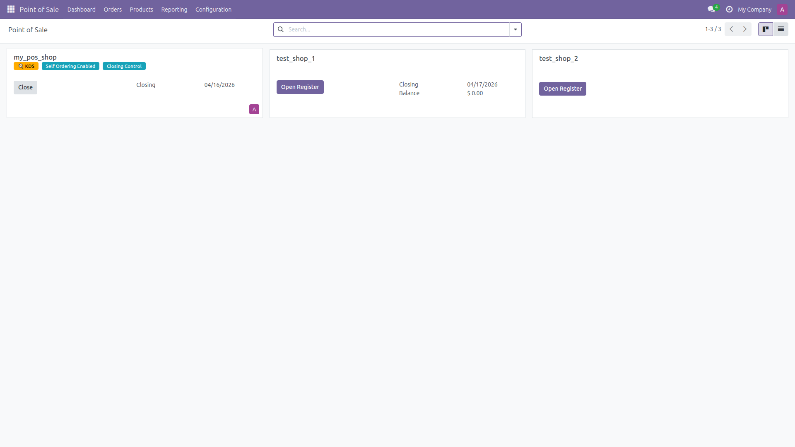

**Troubleshooting**

- If the badge does not appear, verify that KDS is enabled on the POS config.
- Refresh the dashboard page if the badge was recently enabled.

---

## Chapter 3: ESC/POS Network Printing

This chapter covers network printing to ESC/POS compatible receipt printers, both via direct local TCP connection and via a cloud relay through Home Assistant.

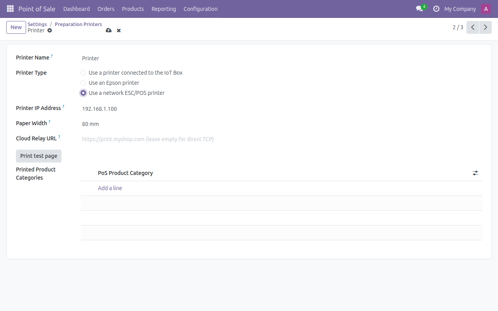

---

### 3.1 Local TCP Mode

Enables direct printing from Odoo to an ESC/POS printer on the local network via TCP port 9100. No IoT Box is required.

**Setup**

1. Navigate to **Point of Sale > Configuration > Settings > Preparation > Printers** and add a new printer.
2. Set the **Type** to **"Use a network ESC/POS printer"**.
3. Enter the printer's **IP Address** (e.g., `192.168.1.100`).
4. The default port is 9100. Change it only if your printer uses a different port.
5. Save the printer configuration.

> **Important:** The Odoo server and the ESC/POS printer must be on the same local network (LAN) for direct TCP printing. If your Odoo is hosted in the cloud, use **Cloud Relay Mode** (section 3.2) instead.

**Usage**

- When a receipt needs to be printed, the Odoo server connects directly to the printer via TCP and sends the ESC/POS data.
- No additional hardware (IoT Box) or software is needed between Odoo and the printer.
- This mode requires the Odoo server and the printer to be on the same network (or have network routing between them).

**Troubleshooting**

- If printing fails, verify the printer is powered on and connected to the network.
- Confirm the IP address is correct by pinging it from the Odoo server: `ping 192.168.1.100`.
- Ensure port 9100 is not blocked by a firewall between the Odoo server and the printer.
- Test the printer using the Test Page button (section 3.5).
- This mode does not work if Odoo is hosted in the cloud and the printer is on a local network. Use Cloud Relay Mode (section 3.2) instead.

---

### 3.2 Cloud Relay Mode

Enables printing from a cloud-hosted Odoo instance to a local ESC/POS printer via a Home Assistant add-on and Cloudflare Tunnel or Nginx Proxy Manager.

**What this solves:** Cloud-hosted Odoo servers cannot reach printers on your local network directly. The Home Assistant `ha-addon-escpos-print-proxy` add-on acts as a bridge -- it receives print jobs from the internet (via HTTPS) and forwards them to your local printer (via TCP).

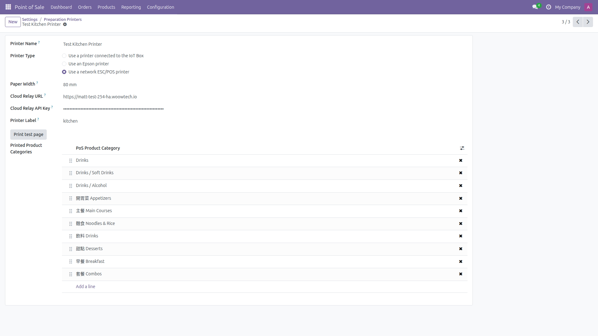

For the complete setup guide (Home Assistant add-on installation, API key generation, Cloudflare Tunnel / NPM configuration, and Odoo printer setup), see [`ha-addon-escpos-print-proxy/DOCS.md`](../ha-addon-escpos-print-proxy/DOCS.md).

**Troubleshooting**

- If printing fails, verify the Cloudflare Tunnel is running and the URL is accessible from the internet.
- Check that the API key in Odoo matches the one in the Home Assistant add-on configuration.
- Test the relay by accessing the health check endpoint: `GET https://print.yourdomain.com/status`.
- Check the Home Assistant add-on logs for error messages.
- Ensure the local printer is reachable from the Home Assistant host on port 9100.

---

### 3.3 Per-printer Paper Width

Allows selecting 80mm or 58mm paper width for each printer individually.

**Setup**

1. Navigate to the printer form (**Point of Sale > Configuration > Settings > Preparation > Printers**).
2. Find the **Paper Width** setting.
3. Select either **80 mm** or **58 mm**.
4. Save.

**Usage**

- The selected paper width determines the formatting of printed receipts.
- 80mm is the standard width for most receipt printers.
- 58mm is common for smaller portable printers.
- When using Cloud Relay Mode, the paper width setting is sent to the Home Assistant add-on so the relay formats output correctly.

**Troubleshooting**

- If the receipt appears cut off or has excessive whitespace, verify the paper width matches the actual paper loaded in the printer.
- When using cloud relay, ensure the Home Assistant add-on is running version 0.4.0 or later, which supports per-printer paper width.

---

### 3.4 Multi-printer Labels

Assigns labels to printers for routing print jobs to specific devices (e.g., "kitchen," "invoice," "bar").

**Setup**

1. Navigate to the printer form.
2. Enter a **Label** for the printer (e.g., `kitchen`, `invoice`, `bar`).
3. Save.
4. When using Cloud Relay Mode, the label is sent to the Home Assistant add-on, which routes the job to the printer matching that label.

**Usage**

- Different types of receipts or tickets can be routed to different printers.
- For example, kitchen order tickets go to the printer labeled "kitchen," while customer receipts go to the printer labeled "invoice."
- The POS config determines which printer to use for each type of print job.

**Troubleshooting**

- If print jobs go to the wrong printer, verify the label in Odoo matches exactly (case-sensitive) with the label configured in the Home Assistant add-on.
- If no label is specified, the relay uses its default printer.

---

### 3.5 Test Page

Prints a test page to verify the printer connection and configuration.

**Setup**

1. No additional setup. The test button is available on the printer form.

**Usage**

1. Open the printer form (**Point of Sale > Configuration > Settings > Preparation > Printers**).
2. Click the **"Print test page"** button.
3. The printer should output a test page confirming the connection is working.

**Troubleshooting**

- If the test page does not print, review the troubleshooting steps for your printing mode (Local TCP in section 3.1 or Cloud Relay in section 3.2).
- Check the Odoo server logs for error messages related to the print attempt.
- For cloud relay, verify the add-on is running and the tunnel is active.

---

## Chapter 4: Taiwan E-Invoice

This chapter covers Taiwan Ministry of Finance (MOF) compliant electronic invoice integration via the ECPay API. These features are specific to businesses operating in Taiwan.

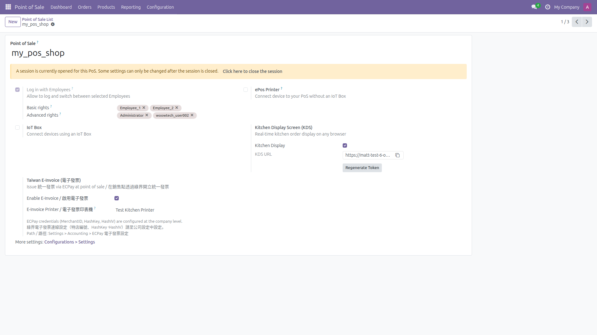

> **Prerequisites for Taiwan Uniform Invoice printing:**
>
> To have POS create and print Taiwan Uniform Invoices on an ESC/POS printer:
> 1. Set up an ESC/POS network printer (see Chapter 3).
> 2. Navigate to the POS config form (**Point of Sale > Configuration > Point of Sales** > select shop).
> 3. In the **Taiwan E-Invoice** section, enable **"Enable E-Invoice"**.
> 4. Select the printer in the **"E-Invoice Printer"** field.
> 5. Configure ECPay API credentials (see section 4.1).

---

### 4.1 MOF Compliant

Provides full Taiwan unified invoice (tong yi fa piao) support via the ECPay API, compliant with MOF regulations.

**Setup**

1. Install the `ecpay_invoice_tw` and `payment_ecpay` modules if not already installed.
2. Navigate to **Settings > Accounting** and locate the **ECPay E-Invoice** section.
3. Enter your ECPay API credentials:
   - Merchant ID
   - Hash Key
   - Hash IV
4. Save the settings.

**Usage**

- Once configured, the system can issue, view, and void electronic invoices through the ECPay API.
- Invoices are generated in the format required by Taiwan's MOF.
- All invoice data is stored in Odoo for record-keeping and audit purposes.

**Troubleshooting**

- If invoice issuance fails, verify the ECPay credentials are correct.
- Ensure the ECPay account is active and has the e-invoice service enabled.
- Check Odoo server logs for API error responses from ECPay.
- For testing, use ECPay's sandbox environment before switching to production credentials.

---

### 4.2 Carrier Types

Supports multiple e-invoice carrier types as required by Taiwan MOF regulations.

**Setup**

1. Enable e-invoice on the POS config (see section 4.5).
2. No additional carrier-type-specific setup is needed. All carrier types are available by default.

**Usage**

During payment at the POS, the cashier or customer selects the invoice carrier type:

- **Print** -- A paper invoice is printed.
- **Mobile Barcode** -- The customer provides their mobile barcode carrier number (starting with `/`).
- **Donation** -- The invoice is donated to a registered charity (Love Code).
- **B2B** -- A business invoice is issued with the buyer's tax ID (gui tong bian hao). An optional paper copy can also be printed.

**Troubleshooting**

- If carrier type options do not appear during payment, ensure e-invoice is enabled on the POS config.
- For Mobile Barcode, the barcode must be in the correct format (starting with `/` followed by 7 characters).
- For Donation, the Love Code must be a valid registered charity code.
- For B2B invoices, a valid 8-digit tax ID is required.

---

### 4.3 QR Code Generation

Automatically generates left and right QR codes on the invoice per MOF specification, using data returned from ECPay after issuance.

**Setup**

1. No additional configuration. QR codes are generated automatically when an e-invoice is successfully issued through ECPay.

**Usage**

- After an e-invoice is issued, the QR code data is returned by ECPay and stored in Odoo.
- The QR codes conform to the MOF specification and can be printed on the receipt (see section 4.7).
- Customers can scan the QR code to verify their invoice on the MOF platform.

**Troubleshooting**

- If QR codes are not generated, verify that the invoice was successfully issued (check the invoice status in Odoo).
- Ensure the ECPay API response includes the QR code data fields.

---

### 4.4 Invoice Lifecycle

Supports the full invoice lifecycle: issue, view, and void.

**Setup**

1. Ensure ECPay credentials are configured (section 4.1) and e-invoice is enabled on the POS config.

**Usage**

- **Issue** -- Invoices are issued automatically after payment (if auto-issuance is enabled) or can be triggered manually.
- **View** -- Issued invoices can be viewed in Odoo with all details (invoice number, carrier, amount, QR codes).
- **Void** -- If an invoice needs to be cancelled (e.g., order refund), use the void function. The void request is sent to ECPay's API, and the invoice status is updated in Odoo.

**Troubleshooting**

- Voided invoices cannot be re-issued. A new invoice must be created if needed.
- If voiding fails, check that the invoice has not already been voided and that the ECPay API is accessible.
- Invoice void operations may have time restrictions imposed by MOF regulations (typically must be voided within the same period).

---

### 4.5 Auto Issuance

Automatically issues an e-invoice after online payment confirmation, removing the need for manual invoice creation.

**Setup**

1. Enable **E-Invoice** on the POS config (see section 4.1). Auto-issuance is built-in -- there is no separate toggle.

**Usage**

- When a customer completes an online payment (e.g., via the self-order kiosk), the e-invoice is automatically issued through ECPay.
- The invoice details (number, carrier, QR codes) are stored in the order record.
- No staff intervention is required for the invoice issuance.

**Troubleshooting**

- If auto-issuance is not triggering, verify that the payment was confirmed successfully (not just initiated).
- Check that ECPay credentials are valid and the API is responsive.
- Review Odoo server logs for any API errors during the issuance attempt.

---

### 4.6 Tax ID Lookup

Looks up a company name from the Taiwan GCIS (Government Company Information System) open data using the tax ID (tong bian).

**Setup**

1. No additional configuration. This feature uses GCIS open data and requires no API keys.

**Usage**

- During B2B invoice selection, when the cashier or customer enters a tax ID (8-digit gui tong bian hao), the system automatically looks up the corresponding company name.
- The company name is populated automatically, reducing manual entry and errors.

**Troubleshooting**

- If the lookup returns no result, verify the tax ID is valid and correctly entered (must be exactly 8 digits).
- The lookup requires internet access from the Odoo server to reach the GCIS open data API.
- If the service is temporarily unavailable, the company name can be entered manually.

---

### 4.7 POS Receipt Integration

Prints e-invoice data directly on ESC/POS receipts, including invoice number, carrier information, and QR codes.

**Setup**

1. Navigate to the POS config settings.
2. In the e-invoice section, select the **E-Invoice Printer** to designate which ESC/POS printer should print invoice receipts.
3. Save.

**Usage**

- When an e-invoice is issued, the invoice data is automatically included on the printed receipt.
- The receipt contains the invoice number, carrier type, and QR codes per MOF specification.
- The receipt is printed on the designated e-invoice printer.

**Troubleshooting**

- If invoice data does not appear on the receipt, verify that an e-invoice printer is selected in the POS config.
- Ensure the selected printer is configured correctly (see Chapter 3).
- If QR codes are not printing, verify the printer supports graphic printing and the paper width is sufficient (80mm recommended).

---

## Chapter 5: Portal POS Access

This chapter covers how to grant portal users (e.g., franchisees, partners) access to operate the POS cashier interface remotely through the Odoo portal.

---

### 5.1 Admin Setup: Grant Portal User Access to POS

Administrators assign POS shop access to portal users through the user's related partner record.

**Setup**

1. Navigate to **Settings > Users & Companies > Users**.
2. Select the portal user (e.g., `woowtech_user002@protonmail.com`).
3. Click the **Related Partner** button (at the top of the user form) to open the partner record.
4. Click the **Portal POS** tab.
5. In the **Portal POS Configs** field, add the POS configuration(s) this user should have access to.
6. Click **Save**.

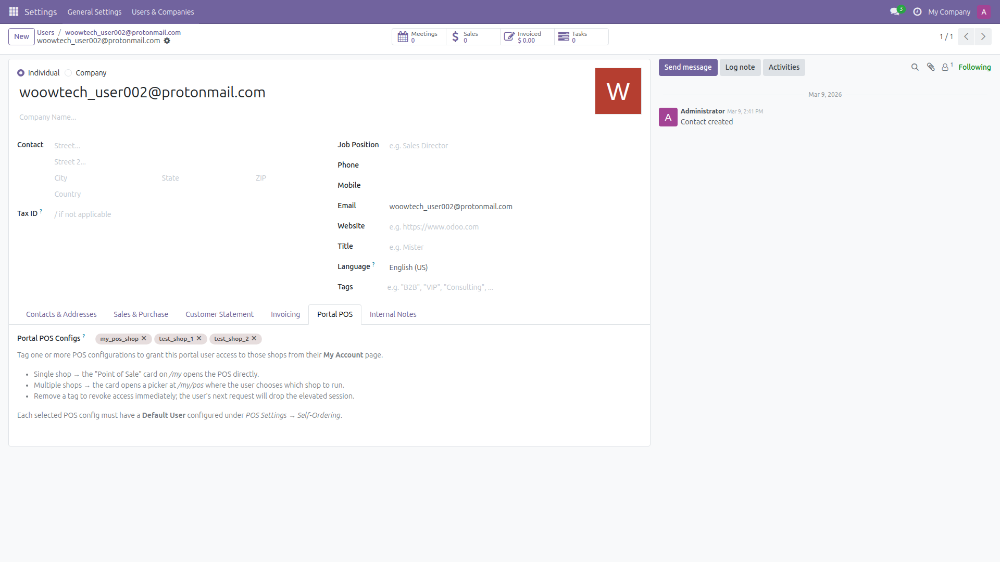

> **Important:** Each POS configuration must have a **Default User** set under **Point of Sale > Configuration > Settings > Mobile self-order & Kiosk**. This internal user's permissions are used when the portal user operates the POS.

**Troubleshooting**

- If the **Portal POS** tab does not appear on the partner form, verify that the `pos_self_order_enhancement` module is installed.
- If no POS configurations appear in the dropdown, ensure at least one POS shop exists and is active.
- The portal user must have an active portal account (not just a contact record).

---

### 5.2 Portal User: Access POS from /my Page

After the administrator grants access, the portal user can log in and access the POS cashier interface from the portal home page.

**Usage**

1. The portal user logs in to the Odoo website (e.g., `https://your-odoo.com/web/login`).
2. After login, the user is redirected to the `/my` portal home page.
3. A **Point of Sale** card appears on the portal home page showing the assigned shop(s).
4. **Single shop assigned:** Clicking the card opens the POS cashier interface directly.
5. **Multiple shops assigned:** Clicking the card opens a store picker page at `/my/pos` where the user selects which shop to operate.
6. The full POS cashier interface loads. The portal user can take orders, process payments, and perform all standard POS operations.

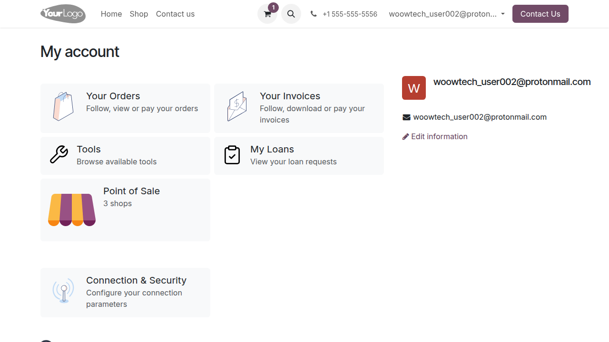

**Troubleshooting**

- If the **Point of Sale** card does not appear on `/my`, verify that the administrator has assigned POS configuration(s) to the user's partner record (see section 5.1).
- If clicking the card shows "Access Denied", ensure the POS configuration has a **Default User** set under Settings > Mobile self-order & Kiosk.
- If the POS interface loads but operations fail, check that the Default User has sufficient POS permissions (typically an internal user with full POS access rights).
- If the portal user sees a blank page, clear the browser cache and try again.

---

## Appendix: Quick Reference

### Where to Find Settings

| Setting | Location |
|---------|----------|
| Self-Ordering Mode | Settings > Mobile self-order & Kiosk |
| KDS Enable / Token | POS Config > Kitchen Display Screen |
| E-Invoice Enable | POS Config > Taiwan E-Invoice |
| Printer Setup | Settings > Preparation > Printers |
| Hold & Fire Category | Configuration > PoS Product Categories |
| Portal POS Assignment | Settings > Users > select user > Related Partner > Portal POS tab |
| ECPay Credentials | Settings > Accounting > ECPay E-Invoice |

### Feature Activation Summary

| Feature | Activation |
|---------|-----------|
| Remove Cancel Button | Auto-enabled |
| Continue Ordering | Auto-enabled |
| Pay Per Order | Manual: Pay After = Each Order |
| Pay at Counter | Available in both payment modes |
| Friendly Payment Page | Auto-enabled |
| Hide Tax Display | Auto-enabled |
| Sold Out (86) | Manual: toggle per product in POS |
| KDS | Manual: enable in POS Config |
| Hold & Fire | Manual: enable per category |
| Network Printing | Manual: add printer in POS Config |
| E-Invoice | Manual: enable in POS Config + credentials |
| Portal POS Access | Manual: assign POS configs via Users > Related Partner > Portal POS |
