# POS Self Order Enhancement 使用手冊

**模組版本：** 18.0.1.3.0
**適用平台：** Odoo 18 Community / Enterprise
**開發者：** WoowTech

---

## 目錄

- [第一章：自助點餐增強](#第一章自助點餐增強)
  - [1.1 移除取消按鈕](#11-移除取消按鈕)
  - [1.2 繼續點餐](#12-繼續點餐)
  - [1.3 整單付款模式](#13-整單付款模式)
  - [1.4 臨櫃付款](#14-臨櫃付款)
  - [1.5 友善付款頁面](#15-友善付款頁面)
  - [1.6 隱藏稅金顯示](#16-隱藏稅金顯示)
  - [1.7 售完標記（86）](#17-售完標記86)
- [第二章：廚房顯示螢幕（KDS）](#第二章廚房顯示螢幕kds)
  - [2.1 即時訂單顯示](#21-即時訂單顯示)
  - [2.2 品項級追蹤](#22-品項級追蹤)
  - [2.3 品項總覽（全日）](#23-品項總覽全日)
  - [2.4 Hold & Fire（暫停與出餐）](#24-hold--fire暫停與出餐)
  - [2.5 退回 / 重做](#25-退回--重做)
  - [2.6 上餐追蹤](#26-上餐追蹤)
  - [2.7 套餐視覺化](#27-套餐視覺化)
  - [2.8 批次操作](#28-批次操作)
  - [2.9 計時器顏色提示](#29-計時器顏色提示)
  - [2.10 音效提醒](#210-音效提醒)
  - [2.11 多語系](#211-多語系)
  - [2.12 Token 認證](#212-token-認證)
  - [2.13 儀表板徽章](#213-儀表板徽章)
- [第三章：ESC/POS 網路出單機](#第三章escpos-網路出單機)
  - [3.1 本地 TCP 模式](#31-本地-tcp-模式)
  - [3.2 雲端中繼模式](#32-雲端中繼模式)
  - [3.3 每台出單機紙寬設定](#33-每台出單機紙寬設定)
  - [3.4 多出單機標籤](#34-多出單機標籤)
  - [3.5 測試頁](#35-測試頁)
- [第四章：台灣電子發票](#第四章台灣電子發票)
  - [4.1 符合財政部規範](#41-符合財政部規範)
  - [4.2 載具類型](#42-載具類型)
  - [4.3 QR Code 生成](#43-qr-code-生成)
  - [4.4 發票生命週期](#44-發票生命週期)
  - [4.5 自動開立](#45-自動開立)
  - [4.6 統編查詢](#46-統編查詢)
  - [4.7 POS 收據整合](#47-pos-收據整合)
- [第五章：入口 POS 存取](#第五章入口-pos-存取)
  - [5.1 管理員設定：授權入口使用者存取 POS](#51-管理員設定授權入口使用者存取-pos)
  - [5.2 入口使用者：從 /my 頁面存取 POS](#52-入口使用者從-my-頁面存取-pos)

---

## 第一章：自助點餐增強

本章涵蓋自助點餐流程的七項增強功能。這些功能改善顧客在自助點餐機（Kiosk）或手機掃碼點餐時的使用體驗。

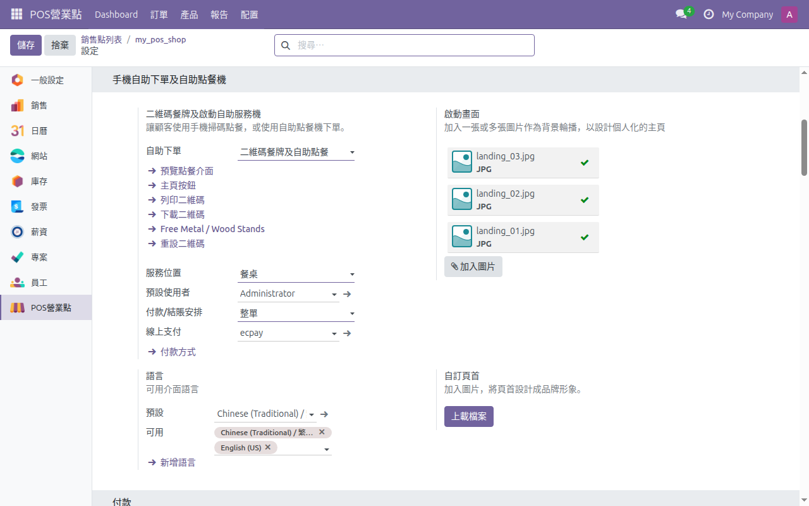

---

### 1.1 移除取消按鈕

安裝模組後自動移除自助點餐介面上的「取消訂單」按鈕，防止顧客在送出訂單後自行取消。

**設定**

1. 安裝 `pos_self_order_enhancement` 模組後自動啟用，無需額外設定。
2. 此功能僅影響自助點餐介面，不影響 POS 後台操作。

**使用方式**

1. 顧客在自助點餐介面送出訂單後，畫面上不再出現「取消」按鈕。
2. 如需取消訂單，員工可在 POS 後台選取該訂單並執行取消。

**疑難排解**

- 取消按鈕仍然出現：確認模組已正確安裝並重新載入自助點餐頁面。
- 員工無法取消訂單：確認該員工帳號具有 POS 操作權限。

---

### 1.2 繼續點餐

當同一桌存在未付款訂單時，自助點餐首頁自動顯示「繼續點餐」按鈕，讓顧客在原有訂單基礎上加點。

**設定**

1. 安裝模組後自動啟用，無需額外設定。
2. 需確保 POS 已啟用餐廳模式並設定桌位。

**使用方式**

1. 顧客掃碼進入自助點餐首頁。
2. 若該桌位已有未付款訂單，首頁會顯示「繼續點餐」按鈕。
3. 點擊後可在原訂單上新增品項，新品項會併入現有訂單。

**疑難排解**

- 未出現「繼續點餐」按鈕：確認該桌位確實存在未付款訂單。
- 加點品項未併入原訂單：確認 POS 的餐廳模式和桌位設定正確。

---

### 1.3 整單付款模式

將付款時機從「每次點餐即付」改為「所有品項點完後統一付款」，適合多次加點的用餐場景。

**設定**

1. 前往 POS營業點 > 配置 > 設定。
2. 找到「手機自助下單及自助點餐機」區段。
3. 在「付款/結賬安排」下拉選單中選擇「整單」。
4. 儲存設定。

**使用方式**

1. 顧客完成點餐並送出訂單後，訂單不會立即要求付款。
2. 顧客可繼續多次加點。
3. 用餐結束後，透過自助點餐頁面進入付款流程，一次結清所有品項。

**付款流程情境說明**

#### 情境 A：整單付款 + 線上付款（ECPay 綠界）
1. 顧客在點餐機下單。訂單建立為草稿，狀態為 `pending_online`。
2. 顧客被導向綠界付款頁面。
3. 付款成功。訂單狀態變為 `paid`，訂單自動送至廚房。
4. 所有 Hold & Fire 分類自動出餐（無需手動點擊 Fire）。
5. KDS 顯示訂單。廚房員工標記品項完成。訂單狀態變為 `done`。
6. POS 桌位畫面在該桌位上顯示 **「Ready」** 標記。
7. POS 員工點擊 **「Served」**。訂單標記為已上餐，從進行中畫面移除。

#### 情境 B：整單付款 + 臨櫃付款
1. 顧客下單。狀態為 `pending_online`。
2. 顧客點擊 **「Pay at Counter」**。狀態變為 `pending_counter`。
3. POS 桌位畫面在該桌位上顯示 **「Counter Pay」** 標記（橘色 $ 圖示）。
4. 員工開啟該桌位，在收銀台處理付款。
5. 訂單送至廚房。KDS 生命週期與情境 A 相同（自動出餐啟用）。

#### 情境 C：餐後付款 + 線上付款（ECPay 綠界）
1. 顧客下單。訂單立即對 POS 和廚房可見（無付款閘道）。
2. Hold & Fire 分類維持**暫停**狀態 -- 員工從 POS 手動通知出餐。
3. 顧客可繼續點餐（在同一桌位加點更多品項）。
4. 準備離開時，顧客透過綠界線上付款。
5. 付款確認後自動開立電子發票。

#### 情境 D：餐後付款 + 臨櫃付款
1. 顧客下單。訂單立即對 POS 和廚房可見。
2. Hold & Fire 分類維持暫停 -- 員工手動通知出餐。
3. 顧客隨時可加點更多品項。
4. 用餐完畢後顧客至櫃台付款。
5. 員工在 POS 收銀台處理付款。

**疑難排解**

- 送出訂單後仍跳轉至付款頁面：確認「付款/結賬安排」已正確設為「整單」。
- 顧客找不到付款入口：付款按鈕位於自助點餐首頁，在所有訂單送出後顯示。

---

### 1.4 臨櫃付款

提供顧客選擇「臨櫃付款」（Pay at Counter）的選項，將訂單釋出給 POS 員工處理。此功能在「付款/結賬安排」設為「整單」或「餐點」時皆可使用。

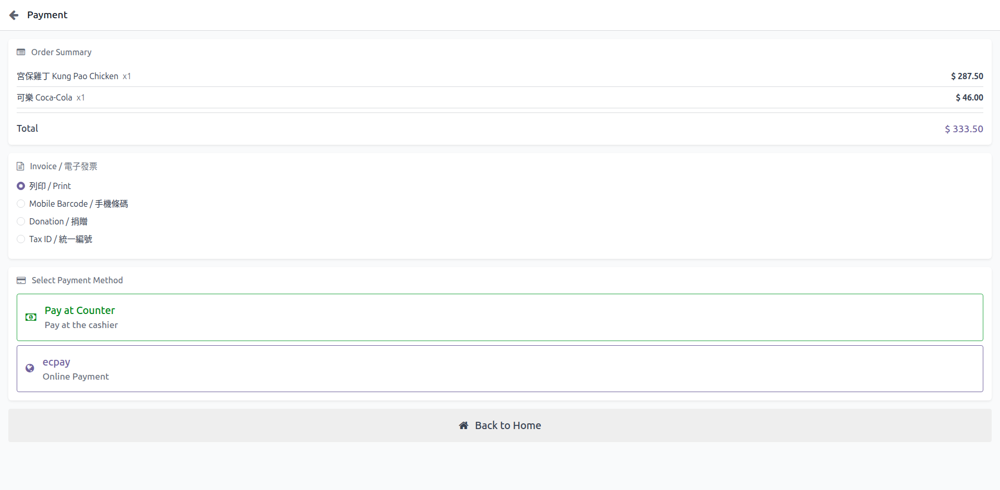

**設定**

1. 前往 POS營業點 > 配置 > 設定，在「手機自助下單及自助點餐機」區段確認「自助下單」已啟用。
2. 啟用後「臨櫃付款」選項自動出現在付款頁面，無需額外設定。

**使用方式**

1. 顧客在付款頁面選擇「臨櫃付款」。
2. 訂單狀態更新並釋出至 POS 後台。
3. POS 員工在收銀畫面看到該訂單，可協助顧客完成現金或其他方式的付款。

**疑難排解**

- 未出現「臨櫃付款」選項：確認「自助下單」已啟用。
- 員工在 POS 看不到訂單：確認 POS 收銀台已開啟且連線正常。

---

### 1.5 友善付款頁面

優化付款頁面的資訊呈現方式，將訂單依點餐次序分組顯示，並標示各次小計金額。

**設定**

1. 安裝模組後自動啟用，無需額外設定。

**使用方式**

1. 顧客進入付款頁面後，可看到訂單按時間順序分組（例如：第 1 次點餐、第 2 次點餐）。
2. 每組顯示該次點餐的品項及小計金額。
3. 頁面底部顯示總金額。

**疑難排解**

- 付款頁面未分組顯示：確認模組已正確安裝並清除瀏覽器快取。
- 金額顯示不正確：確認 POS 的幣別及稅率設定正確。

---

### 1.6 隱藏稅金顯示

在自助點餐的購物車頁面中隱藏稅金明細，簡化顧客介面。

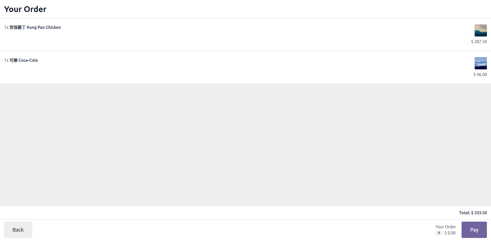

**設定**

1. 安裝模組後自動啟用，無需額外設定。

**使用方式**

1. 顧客在購物車頁面僅看到品項價格與總金額，不會顯示稅金細項。
2. 稅金仍會正確計入訂單總額，僅是前端不顯示。

**疑難排解**

- 稅金仍然顯示：清除瀏覽器快取並重新載入自助點餐頁面。
- 金額計算有誤：稅金仍正常計算，請在 POS 後台確認稅率設定。

---

### 1.7 售完標記（86）

員工可在 POS 將商品標記為「售完」（86），標記即時同步至所有自助點餐裝置。收銀結束時（關閉 POS 收銀台）自動重置。

**設定**

1. 無需額外設定，功能隨模組安裝啟用。

**使用方式**

1. 員工在 POS 收銀畫面中，找到需要標記的商品。
2. 點擊商品並選擇「售完」（Sold Out）。
3. 所有自助點餐裝置即時更新，該商品顯示為售完且無法加入購物車。
4. 關閉 POS 收銀台（Close Session）時，所有售完標記自動清除。

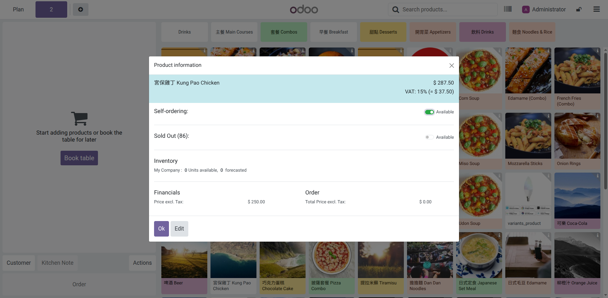

**疑難排解**

- 自助點餐裝置未即時更新：確認裝置網路連線正常。重新整理自助點餐頁面。
- 關閉收銀台後商品仍顯示售完：清除瀏覽器快取並重新載入。

---

## 第二章：廚房顯示螢幕（KDS）

本章涵蓋廚房顯示螢幕的十三項功能。KDS 讓廚房人員在任何瀏覽器上即時查看訂單，無需額外硬體。

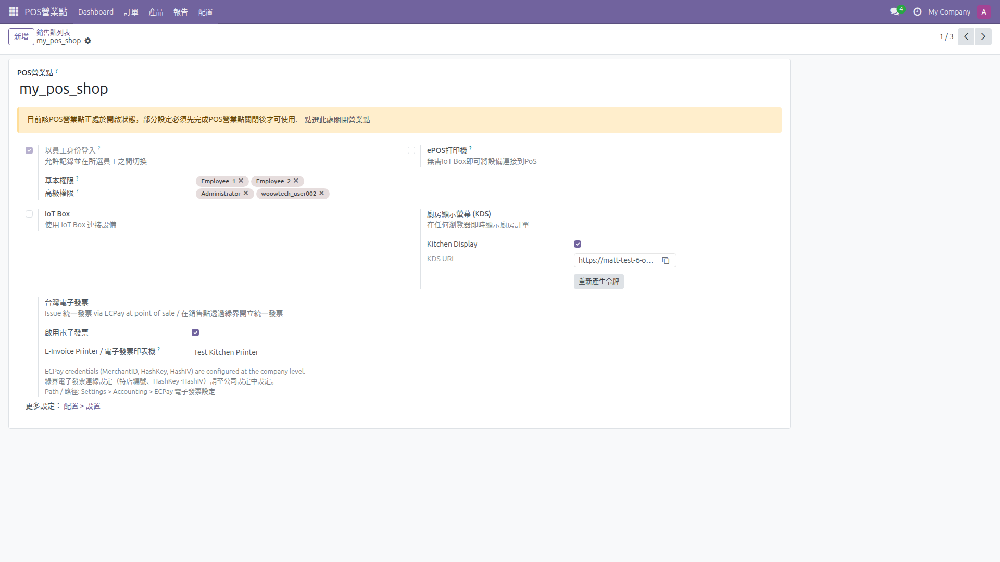

---

### 2.1 即時訂單顯示

在任何瀏覽器上開啟 KDS 頁面，即時顯示來自 POS 和自助點餐的訂單。

**設定**

1. 前往 **POS營業點 > 配置 > POS營業點** > 選擇營業點 > 捲動至「**廚房顯示螢幕 (KDS)**」區段。
2. 勾選「Kitchen Display」並啟用。
3. 系統自動產生 KDS 專屬 URL。
4. 複製該 URL 並在廚房的平板或螢幕瀏覽器中開啟。

**使用方式**

1. 在瀏覽器中開啟 KDS URL。
2. 新訂單會即時出現在畫面上，以卡片形式顯示桌號、品項與數量。
3. 訂單依送單時間排列。

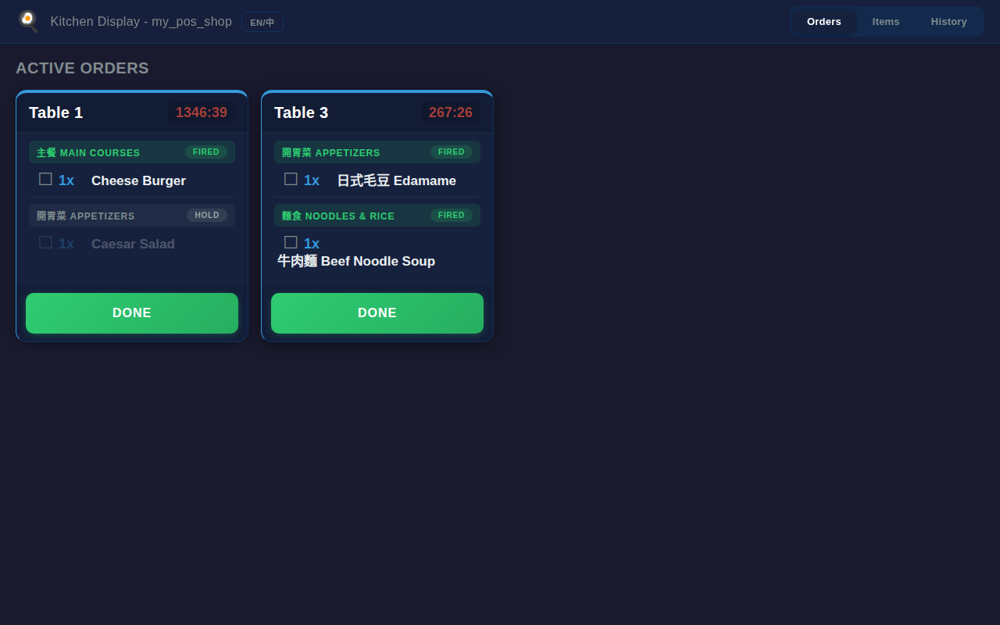

**疑難排解**

- KDS 頁面空白：確認 POS 收銀台已開啟且有訂單。確認 URL 正確。
- 訂單延遲顯示：檢查網路連線品質。KDS 透過輪詢（Polling）更新，正常延遲約數秒。

---

### 2.2 品項級追蹤

在 KDS 上以品項為單位追蹤製作進度。支援劃線完成、一鍵全部完成（Bump）、從歷史記錄召回。

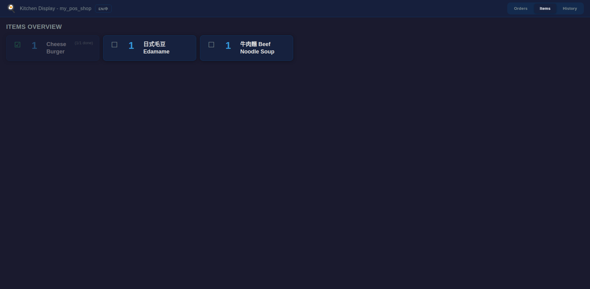

**設定**

1. 啟用 KDS 後自動可用（參見 2.1）。

**使用方式**

1. 點擊單一品項：該品項顯示劃線，表示已完成。
2. 點擊「Bump」按鈕：將該訂單所有品項標記為完成，訂單從畫面移除。
3. 切換至「歷史」分頁可查看已完成訂單，點擊「召回」（Recall）可將訂單重新顯示在主畫面。

**疑難排解**

- 無法劃線品項：確認 KDS URL 的 Token 有效。
- Bump 後訂單消失但未完成：訂單已移至歷史記錄，可從中召回。

---

### 2.3 品項總覽（全日）

KDS 的「品項」分頁彙總顯示當日所有訂單中各品項的總數量，方便廚房備料。

**設定**

1. 啟用 KDS 後自動可用（參見 2.1）。

**使用方式**

1. 在 KDS 頁面切換至「品項」（Items）分頁。
2. 查看當日所有品項的彙總數量。
3. 數量會隨新訂單進入自動更新。

**疑難排解**

- 品項數量不正確：確認所有訂單均已正確送出。重新整理頁面。

---

### 2.4 Hold & Fire（暫停與出餐）

將特定分類的品項設為「暫停」（Hold），廚房先不製作。員工從 POS 發出「出餐」（Fire）指令後，品項才在 KDS 上變為待製作狀態。

**設定**

1. 前往 POS營業點 > 配置 > POS產品類別。
2. 選擇或建立需要暫停出餐控制的分類。
3. 在「KDS 暫停 & 出餐」區段，勾選「Hold & Fire」選項。
4. 儲存設定。

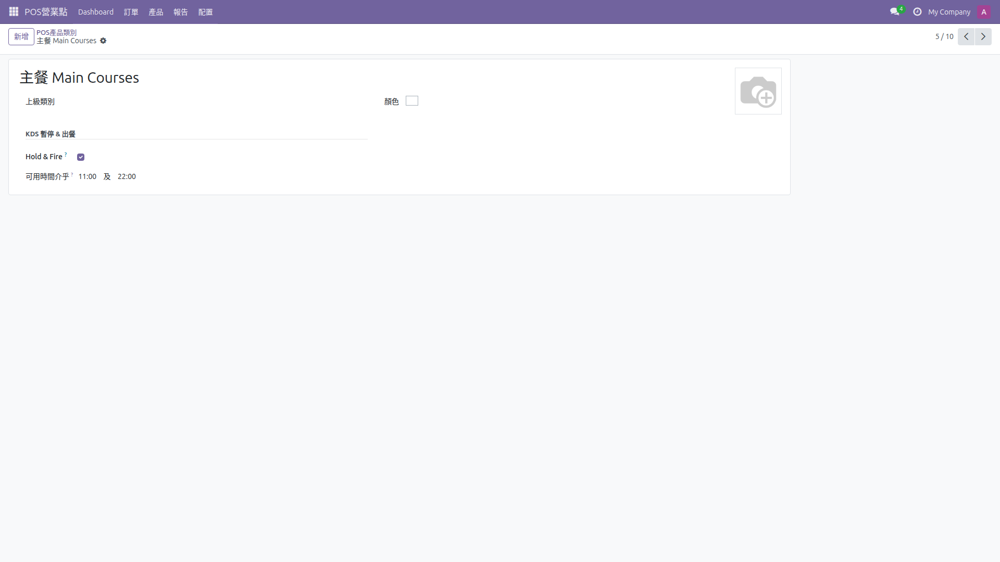

**使用方式**

1. 顧客點餐時，屬於「Hold」分類的品項會在 KDS 上顯示「暫停」（Pending）徽章。
2. 廚房人員暫不製作這些品項。
3. 員工在 POS 收銀台選取該訂單，點擊「通知出餐」（Fire）。
4. KDS 上的暫停徽章移除，品項變為正常待製作狀態。

> **重要提示：** 當啟用「整單付款」模式時，Hold & Fire 分類會自動變為自動出餐。一旦付款確認，所有暫停的分類會立即通知廚房 -- 無需手動點擊「Fire」按鈕。這是因為在整單付款模式下沒有收銀員可以手動安排出餐順序。
>
> 在「餐後付款」模式下，Hold & Fire 正常運作 -- 員工必須從 POS 終端手動通知各道菜出餐。

**疑難排解**

- 品項未顯示暫停徽章：確認該品項的 POS產品類別已啟用「Hold & Fire」。
- 點擊 Fire 後 KDS 未更新：檢查網路連線，等待幾秒後重新整理 KDS 頁面。

---

### 2.5 退回 / 重做

POS 員工可將已完成的品項標記為「退回」並記錄原因，品項會重新出現在 KDS 上並顯示「重做」標記。

**設定**

1. 啟用 KDS 後自動可用（參見 2.1）。

**使用方式**

1. 員工在 POS 收銀台選取需要退回的訂單。
2. 點擊「退回」（Return）按鈕。
3. 輸入退回原因（例如：品質不符、顧客退回）。
4. 該品項重新出現在 KDS 畫面上，並標示「重做」（Redo）標記及退回原因。
5. 廚房人員依標記重新製作。

**疑難排解**

- 退回按鈕不可用：確認訂單狀態允許退回操作。
- KDS 未顯示重做品項：檢查 KDS 連線狀態並重新整理頁面。

---

### 2.6 上餐追蹤

POS 員工可在品項製作完成後標記「已上餐」，追蹤品項從廚房到桌面的完整流程。

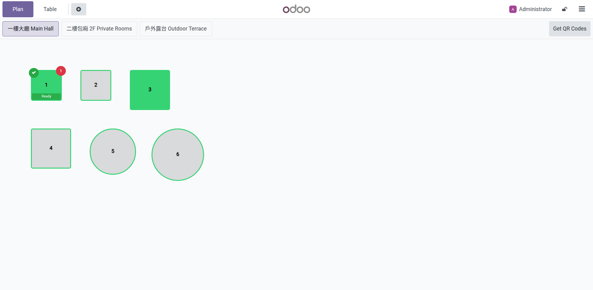

**設定**

1. 啟用 KDS 後自動可用（參見 2.1）。

**使用方式**

1. 員工在 POS 收銀台選取訂單。
2. 點擊「已上餐」（Served）按鈕。
3. 選擇已上餐的品項。
4. 品項狀態更新為「已上餐」。

**疑難排解**

- 無法標記已上餐：確認品項已在 KDS 上被標記為完成。
- 狀態未同步：檢查網路連線並重新整理 POS 畫面。

---

### 2.7 套餐視覺化

KDS 上以結構化方式顯示套餐（Combo）訂單：主品項正常顯示，子品項以縮排形式列在下方。

**設定**

1. 啟用 KDS 後自動可用（參見 2.1）。
2. 需在 POS 中設定套餐（Combo）商品。

**使用方式**

1. 顧客在自助點餐或 POS 點選套餐商品。
2. KDS 上顯示套餐主品項名稱。
3. 套餐中的子品項（例如：附餐飲料、配菜）以縮排方式列在主品項下方。

**疑難排解**

- 子品項未縮排顯示：確認商品已正確設定為套餐（Combo）類型。

---

### 2.8 批次操作

在 KDS 的「品項」分頁中，點擊某商品名稱即可將所有訂單中的同一商品品項一次全部標記為完成。

**設定**

1. 啟用 KDS 後自動可用（參見 2.1）。

**使用方式**

1. 在 KDS 切換至「品項」分頁。
2. 點擊某商品名稱（例如：「招牌牛肉麵」）。
3. 所有訂單中該商品的品項全部標記為完成。

**疑難排解**

- 部分品項未被標記：確認品項確實屬於同一商品。重新整理頁面後再試。

---

### 2.9 計時器顏色提示

KDS 上每張訂單卡片顯示計時器，依經過時間變更顏色以提醒廚房人員注意等候時間。

**設定**

1. 啟用 KDS 後自動可用（參見 2.1）。

**使用方式**

1. 訂單卡片上方的計時器會顯示自送單以來的經過時間。
2. 顏色變化：
   - 綠色：正常時間範圍。
   - 黃色：等候時間稍長，需注意。
   - 紅色：等候時間過長，需優先處理。

**疑難排解**

- 計時器未顯示：確認 KDS 頁面已正常載入。清除快取後重新整理。
- 計時器不準確：確認伺服器時間設定正確。

---

### 2.10 音效提醒

新訂單進入及品項重做時，KDS 會播放提示音效。

**設定**

1. 啟用 KDS 後自動可用（參見 2.1）。
2. 部分瀏覽器要求使用者先與頁面互動（例如：點擊一次頁面）才會允許播放音效。

**使用方式**

1. 開啟 KDS 頁面後，建議先點擊頁面任意位置以啟用音效權限。
2. 新訂單進入時會播放提示音。
3. 品項被標記為重做時也會播放提示音。

**疑難排解**

- 沒有聽到音效：先點擊 KDS 頁面任意位置以啟用瀏覽器的音效權限。
- 檢查裝置音量設定是否正常。
- 確認瀏覽器未封鎖自動播放音效。

---

### 2.11 多語系

KDS 介面支援英文（English）及繁體中文（Traditional Chinese）切換。

**設定**

1. 啟用 KDS 後自動可用（參見 2.1）。

**使用方式**

1. 在 KDS 頁面上找到語系切換按鈕。
2. 切換至所需語系，介面文字即時更新。

**疑難排解**

- 部分文字未翻譯：可能為新增功能的翻譯尚未完成。請回報給模組開發者。

---

### 2.12 Token 認證

KDS 透過 URL 中的 Token 進行認證，無需登入 Odoo 帳號即可使用。

**設定**

1. 前往 POS營業點 > 配置 > 設定 > 廚房顯示螢幕 (KDS) 區段。
2. KDS URL 中自動包含認證 Token。
3. 如需重新產生 Token（例如：安全考量），點擊「重新產生令牌」按鈕。
4. 舊的 Token 立即失效，需將新 URL 更新至所有 KDS 裝置。

**使用方式**

1. 複製含 Token 的完整 KDS URL。
2. 在廚房裝置的瀏覽器中貼上 URL 即可直接使用，無需登入。

**疑難排解**

- KDS 顯示認證錯誤：Token 可能已過期或被重新產生。請至 POS 設定取得最新 URL。
- 多人共用同一 URL 是正常的，Token 不限制同時連線數。

---

### 2.13 儀表板徽章

POS 看板（Dashboard）上的 POS 卡片會顯示 KDS 徽章，方便管理者快速辨識哪些 POS 已啟用 KDS。

**設定**

1. 啟用 KDS 後自動顯示（參見 2.1）。

**使用方式**

1. 前往 POS營業點主頁面（儀表板）。
2. 已啟用 KDS 的 POS 卡片上會顯示「KDS」徽章。
3. 點擊徽章可快速存取 KDS 相關設定。

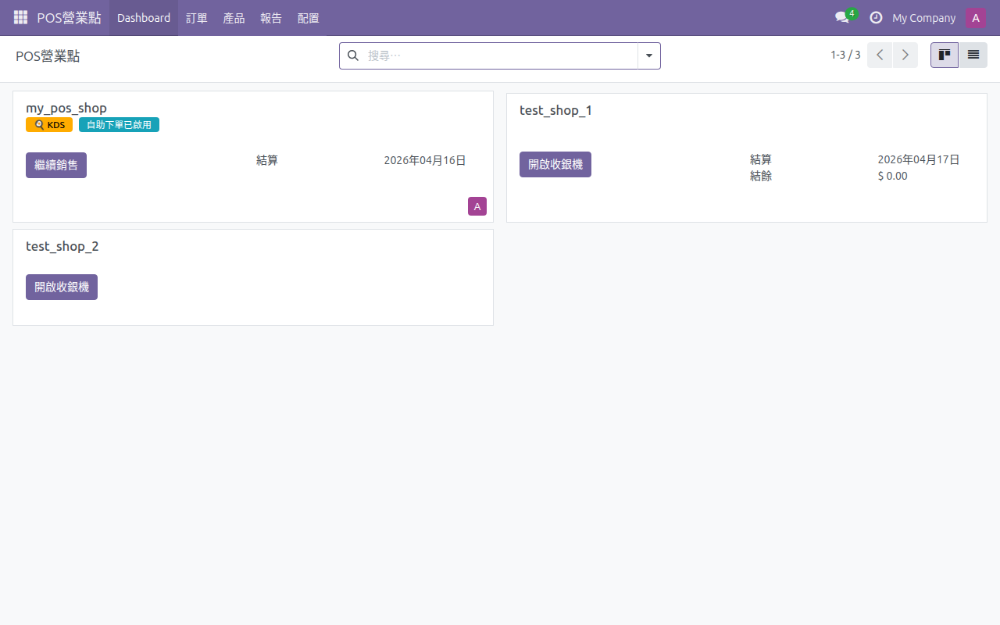

**疑難排解**

- 徽章未顯示：確認 KDS 功能已在該 POS 設定中啟用。

---

## 第三章：ESC/POS 網路出單機

本章涵蓋 ESC/POS 網路出單機的五項功能。支援透過本地 TCP 或雲端中繼方式連接任何相容的 ESC/POS 出單機，無需 IoT Box。

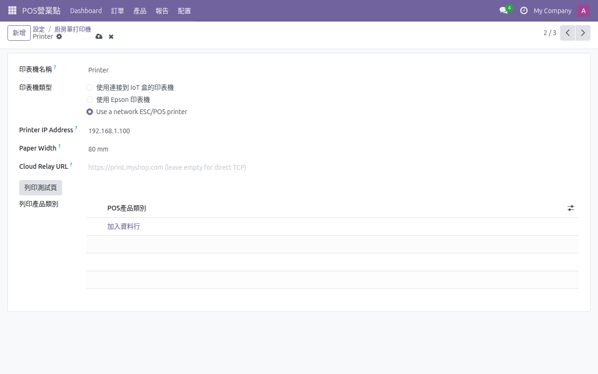

---

### 3.1 本地 TCP 模式

透過區域網路直接以 TCP 協定連接 ESC/POS 出單機。

**設定**

1. 前往 POS營業點 > 配置 > 設定 > 準備工作 > 印表機。
2. 新增印表機。
3. 類型選擇「Use a network ESC/POS printer」。
4. 輸入出單機的 IP 位址。
5. 埠號（Port）預設為 9100（大多數 ESC/POS 出單機的標準埠號）。
6. 儲存設定。

> **重要提示：** Odoo 伺服器和 ESC/POS 出單機必須在同一區域網路（LAN）內才能使用直接 TCP 列印。如果您的 Odoo 是雲端託管，請改用**雲端中繼模式**（3.2 節）。

**使用方式**

1. POS 收銀台送出訂單後，出單機自動列印備餐單。
2. 支援中文及多語系內容列印。

**疑難排解**

- 無法連線出單機：確認出單機 IP 位址正確且與 Odoo 伺服器在同一區域網路。
- 確認出單機已開機且網路正常。
- 嘗試使用 `ping` 指令測試連線。
- 列印內容亂碼：確認出單機韌體支援中文字元集。

---

### 3.2 雲端中繼模式

透過雲端中繼伺服器（Cloud Relay）連接出單機，適用於 Odoo 伺服器與出單機不在同一網路的情境。

**適用情境：** 雲端託管的 Odoo 伺服器無法直接連接本地網路上的出單機。Home Assistant `ha-addon-escpos-print-proxy` 附加元件作為橋接 -- 從網際網路接收列印任務（透過 HTTPS），再轉發至本地出單機（透過 TCP）。

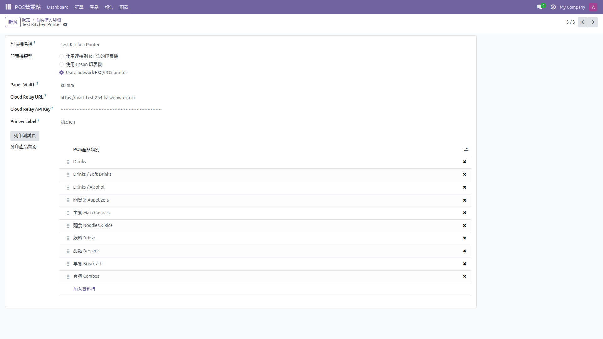

完整設定指南（Home Assistant 附加元件安裝、API 金鑰產生、Cloudflare Tunnel / NPM 設定、Odoo 出單機設定），請參閱 [`ha-addon-escpos-print-proxy/DOCS.md`](../ha-addon-escpos-print-proxy/DOCS.md)。

**疑難排解**

- 列印失敗：確認 Cloudflare Tunnel 正在運作且 URL 可從網際網路存取。
- API 金鑰錯誤：確認 Odoo 中的 API 金鑰與 Home Assistant 附加元件設定中的金鑰一致。
- 測試中繼：存取健康檢查端點 `GET https://print.yourdomain.com/status`。
- 查看 Home Assistant 附加元件日誌以取得錯誤訊息。

---

### 3.3 每台出單機紙寬設定

每台出單機可獨立設定紙張寬度，支援 80mm 和 58mm 兩種常見規格。

**設定**

1. 前往 POS營業點 > 配置 > 設定 > 準備工作 > 印表機。
2. 編輯出單機設定。
3. 在「紙張寬度」（Paper Width）欄位選擇 80mm 或 58mm。
4. 儲存設定。

**使用方式**

1. 列印內容會依據所設定的紙寬自動調整版面配置。
2. 80mm 出單機可容納較多欄位資訊。
3. 58mm 出單機的內容會自動縮排以適應窄紙寬。

**疑難排解**

- 列印內容超出紙張邊界：確認紙寬設定與實際出單機紙寬一致。
- 版面配置異常：切換紙寬設定後，建議執行測試列印確認。

---

### 3.4 多出單機標籤

透過標籤（Tag）區分不同用途的出單機，例如「kitchen」（廚房出單）和「invoice」（發票列印），實現列印路由。

**設定**

1. 前往 POS營業點 > 配置 > 設定 > 準備工作 > 印表機。
2. 為每台出單機設定標籤（例如：kitchen、invoice、bar）。
3. 不同標籤的出單機會接收不同類型的列印任務。

**使用方式**

1. POS 或自助點餐訂單送出後，系統依據品項分類自動路由至對應標籤的出單機。
2. 例如：餐點品項送至「kitchen」出單機，飲料品項送至「bar」出單機。

**疑難排解**

- 訂單未送至正確出單機：確認出單機標籤與品項分類的對應關係。
- 某台出單機未收到列印任務：確認標籤拼寫正確且出單機連線正常。

---

### 3.5 測試頁

從印表機設定表單直接列印測試頁，驗證出單機連線及列印功能。

**設定**

1. 無需額外設定，出單機設定完成後即可使用。

**使用方式**

1. 在印表機設定表單中，點擊「列印測試頁」按鈕。
2. 出單機應列印一張包含基本資訊的測試頁。
3. 確認列印內容正確且清晰。

**疑難排解**

- 點擊按鈕無反應：確認出單機設定（IP、埠號或雲端中繼資訊）已正確填寫並儲存。
- 測試頁內容不完整：確認紙寬設定正確。
- 列印逾時：檢查網路連線或出單機電源狀態。

---

## 第四章：台灣電子發票

本章涵蓋台灣電子發票的七項功能。透過綠界科技（ECPay）平台整合，支援符合財政部規範的統一發票開立。

> **台灣電子統一發票列印前置作業：**
>
> 如需 POS 開立台灣電子統一發票並透過 ESC/POS 出單機列印：
> 1. 設定 ESC/POS 網路出單機（參見第三章）。
> 2. 前往 POS 設定表單（**POS營業點 > 配置 > POS營業點** > 選擇營業點）。
> 3. 在「**台灣電子發票**」區段中，啟用「**啟用電子發票**」。
> 4. 在「**電子發票出單機**」欄位中選擇出單機。
> 5. 設定綠界 API 憑證（參見 4.1 節）。

---

### 4.1 符合財政部規範

透過綠界科技（ECPay）API 開立符合中華民國財政部電子發票規範的統一發票。

**設定**

1. 前往設定 > 會計 > ECPay 電子發票設定。
2. 設定綠界科技的 API 憑證（Merchant ID、Hash Key、Hash IV）。
3. 根據營業需求設定發票字軌（Invoice Track）。
4. 確認公司統一編號（Tax ID）已正確填寫。

**使用方式**

1. 設定完成後，POS 訂單付款時可開立電子發票。
2. 發票資料透過綠界 API 傳送至財政部電子發票整合服務平台。

**疑難排解**

- API 連線失敗：確認綠界憑證（Merchant ID、Hash Key、Hash IV）正確。
- 發票開立失敗：確認字軌設定正確且未用完。聯繫綠界技術支援。

---

### 4.2 載具類型

支援多種發票載具類型：列印、手機條碼、捐贈、B2B（統編）。

**設定**

1. 啟用電子發票功能後自動可用（參見 4.1）。

**使用方式**

1. POS 結帳時，員工或顧客可選擇發票載具類型：
   - **列印**：列印紙本電子發票。
   - **手機條碼**：輸入手機條碼（例如：/ABC1234）存入載具。
   - **捐贈**：選擇捐贈對象的愛心碼。
   - **B2B**：輸入買受人統一編號開立三聯式發票。

**疑難排解**

- 手機條碼格式錯誤：格式為斜線加 7 碼大寫英數字（例如：/ABC1234）。
- 捐贈碼無效：確認愛心碼為有效的捐贈單位代碼。

---

### 4.3 QR Code 生成

電子發票開立成功後，由綠界自動產生 QR Code，方便消費者掃碼查詢發票資訊。

**設定**

1. 啟用電子發票功能後自動可用（參見 4.1）。

**使用方式**

1. 發票開立後，綠界回傳的發票資料中包含 QR Code。
2. QR Code 可顯示在 POS 收據上或電子發票檢視頁面。

**疑難排解**

- QR Code 未顯示：確認綠界 API 回傳資料完整。檢查網路連線。

---

### 4.4 發票生命週期

完整支援電子發票的生命週期管理：開立、檢視、作廢。

**設定**

1. 啟用電子發票功能後自動可用（參見 4.1）。

**使用方式**

1. **開立**：POS 結帳付款時自動或手動開立發票。
2. **檢視**：在 POS 訂單詳情中檢視已開立的發票資訊（發票號碼、金額、載具類型等）。
3. **作廢**：如需作廢，在訂單中選擇作廢發票，系統透過綠界 API 完成作廢程序。

**疑難排解**

- 無法作廢發票：確認發票在允許作廢的期限內。聯繫綠界確認作廢規則。
- 發票資訊未顯示：確認訂單已成功開立發票，檢查綠界 API 回應狀態。

---

### 4.5 自動開立

POS 付款完成後自動開立電子發票，無需員工手動操作。

**設定**

1. 前往 POS營業點 > 配置 > 設定。
2. 找到「台灣電子發票」區段，勾選「啟用電子發票」。
3. 啟用電子發票即包含自動開立功能，無需額外設定單獨的自動開立選項。
4. 儲存設定。

**使用方式**

1. 啟用後，每筆 POS 訂單在付款完成時自動開立電子發票。
2. 員工無需額外操作。
3. 發票資訊會顯示在訂單收據上。

**疑難排解**

- 付款後未自動開立：確認「啟用電子發票」已勾選。確認綠界憑證設定正確。
- 開立失敗但付款成功：發票可稍後從訂單中手動補開。

---

### 4.6 統編查詢

選擇 B2B 載具類型時，輸入統一編號後自動透過 GCIS（商工登記公示資料）查詢公司名稱。

**設定**

1. 啟用電子發票功能後自動可用（參見 4.1）。

**使用方式**

1. 在發票載具選擇 B2B 類型。
2. 輸入買受人的 8 碼統一編號。
3. 系統自動查詢 GCIS 開放資料，帶入公司名稱。
4. 確認資訊後開立三聯式發票。

**疑難排解**

- 查詢無結果：確認統一編號正確（8 碼數字）。GCIS 服務可能暫時無法使用。
- 公司名稱不正確：GCIS 資料可能有更新延遲，可手動修改公司名稱。

---

### 4.7 POS 收據整合

在 POS 設定中指定電子發票出單機，將發票資訊列印在 POS 收據上。

**設定**

1. 前往 POS營業點 > 配置 > 設定 > 台灣電子發票區段。
2. 選擇用於列印電子發票的出單機。
3. 儲存設定。

**使用方式**

1. 付款完成並開立發票後，發票資訊自動透過指定的出單機列印。
2. 收據上包含發票號碼、隨機碼、QR Code 等法規要求的資訊。

**疑難排解**

- 收據未列印發票資訊：確認已指定電子發票出單機且出單機連線正常。
- 列印格式不正確：確認出單機紙寬設定正確（參見 3.3）。

---

## 第五章：入口 POS 存取

本章說明如何授權入口使用者（例如：加盟店、合作夥伴）透過 Odoo 入口網站操作 POS 收銀介面。

---

### 5.1 管理員設定：授權入口使用者存取 POS

管理員透過使用者的相關合作夥伴記錄來指派 POS 店鋪存取權限。

**設定**

1. 前往 **設定 > 使用者與公司 > 使用者**。
2. 選擇入口使用者（例如：`woowtech_user002@protonmail.com`）。
3. 點擊上方的**相關的合作夥伴**按鈕，開啟合作夥伴記錄。
4. 點擊 **Portal POS** 分頁。
5. 在「**Portal POS Configs**」欄位中，新增該使用者可存取的 POS 設定。
6. 點擊**儲存**。

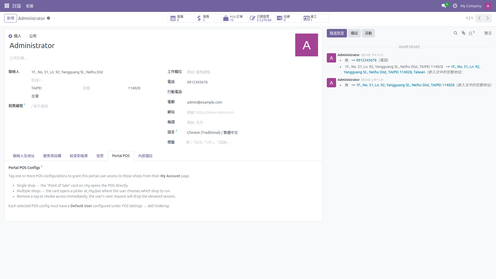

> **重要提示：** 每個 POS 設定必須在 **POS營業點 > 配置 > 設定 > 手機自助下單及自助點餐機** 中設定「**預設使用者**」。入口使用者操作 POS 時將使用此內部使用者的權限。

**疑難排解**

- 合作夥伴表單中未出現 **Portal POS** 分頁：確認 `pos_self_order_enhancement` 模組已安裝。
- 下拉選單中無 POS 設定可選：確認至少有一個 POS 營業點存在且為啟用狀態。
- 入口使用者必須擁有有效的入口帳號（不僅僅是聯絡人記錄）。

---

### 5.2 入口使用者：從 /my 頁面存取 POS

管理員授權後，入口使用者即可登入並從入口首頁存取 POS 收銀介面。

**使用方式**

1. 入口使用者登入 Odoo 網站（例如：`https://your-odoo.com/web/login`）。
2. 登入後自動導向 `/my` 入口首頁。
3. 入口首頁上會顯示 **Point of Sale** 卡片，顯示已指派的店鋪。
4. **僅指派單一店鋪：** 點擊卡片直接進入 POS 收銀介面。
5. **指派多個店鋪：** 點擊卡片後進入 `/my/pos` 店鋪選擇頁面，選擇要操作的店鋪。
6. 載入完整的 POS 收銀介面。入口使用者可執行點餐、結帳、列印收據等所有標準 POS 操作。

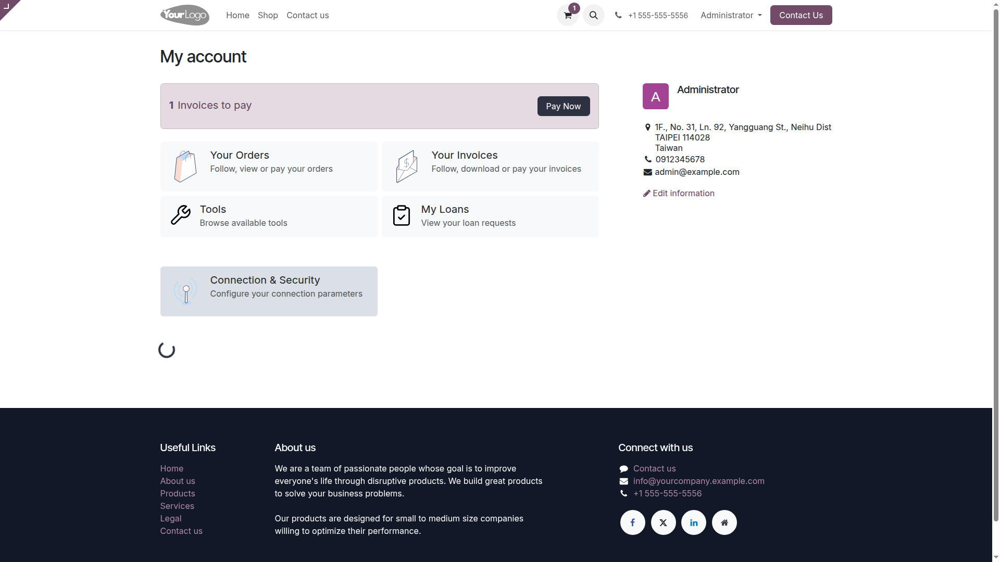

**疑難排解**

- `/my` 頁面未顯示 **Point of Sale** 卡片：確認管理員已在使用者的合作夥伴記錄中指派 POS 設定（參見 5.1）。
- 點擊卡片出現「Access Denied」：確認 POS 設定中已設定「預設使用者」（設定 > 手機自助下單及自助點餐機）。
- POS 介面載入但操作失敗：確認「預設使用者」具有足夠的 POS 操作權限（通常為具有完整 POS 存取權的內部使用者）。
- 入口使用者看到空白頁面：清除瀏覽器快取後重試。

---

## 附錄

### 系統需求

| 項目 | 需求 |
|------|------|
| Odoo 版本 | 18.0 |
| Python 套件 | PIL（Pillow） |
| 相依模組 | pos_self_order, payment, pos_online_payment_self_order, ecpay_invoice_tw, portal |
| 瀏覽器 | Chrome、Firefox、Safari、Edge 最新版本 |

### 常用連結

| 功能 | URL 路徑 |
|------|----------|
| 自助點餐 | 由 POS QR Code 提供 |
| KDS | POS 設定中提供的 KDS URL |
| 顧客入口 | `/my` |
| POS 店鋪選擇 | `/my/pos` |

### 技術支援

如遇到本手冊未涵蓋的問題，請聯繫 WoowTech 技術支援：

- 網站：https://aiot.woowtech.io/
- GitHub：https://github.com/WOOWTECH/Odoo_pos_self_checkout_enhance
