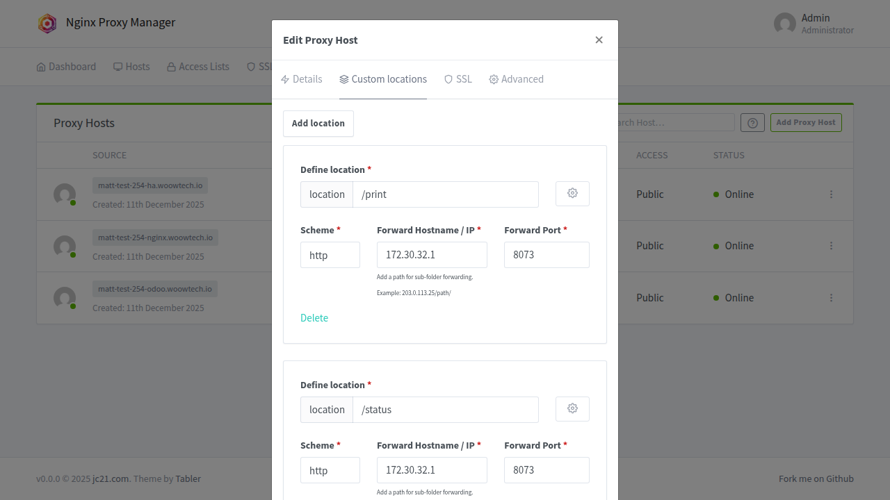
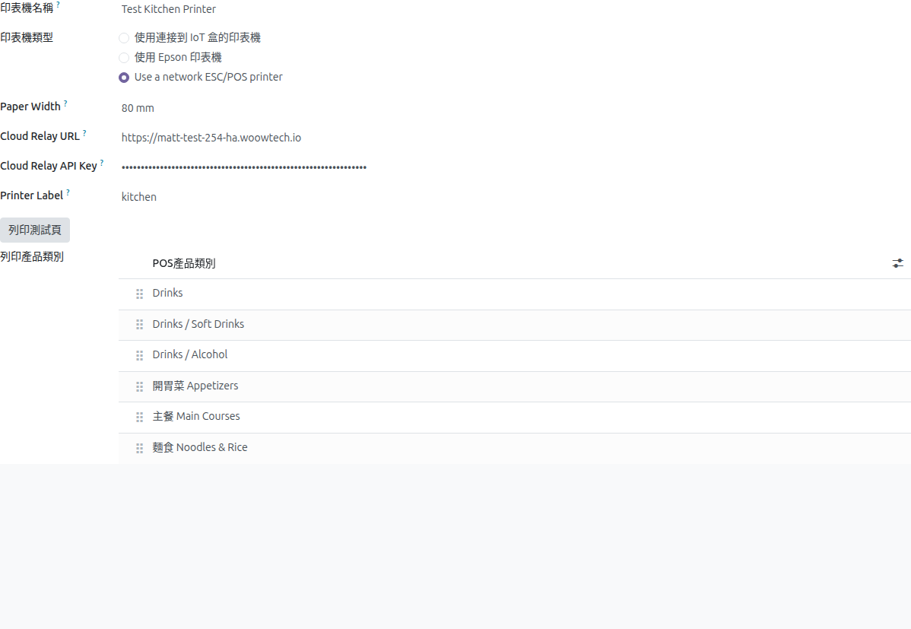

# ESC/POS Print Proxy — Setup Guide

> Bilingual: [English](#english) | [繁體中文](#繁體中文)

---

## English

### 1. Overview

The **ESC/POS Print Proxy** is a Home Assistant add-on that bridges cloud-hosted Odoo POS with local ESC/POS network printers. When Odoo runs in the cloud, it cannot directly reach printers on your shop's local network. This add-on solves that by receiving authenticated print jobs over HTTPS and forwarding them to the printer via TCP on port 9100.

#### Architecture

```
Cloud Odoo Server
  │  HTTPS POST /print (Bearer token + receipt image)
  ▼
Cloudflare CDN (SSL termination)
  │
  ▼
Cloudflare Tunnel Add-on (on Home Assistant)
  │  Outbound-only tunnel — no inbound ports needed
  ▼
Nginx Proxy Manager Add-on (on Home Assistant)
  │  Routes /print and /status to print proxy
  ▼
ESC/POS Print Proxy Add-on (port 8073)
  │  Validates Bearer token
  │  Resolves target printer (by label, IP, or default)
  │  Converts JPEG receipt → ESC/POS raster bitmap
  ▼
Local ESC/POS Printer (TCP:9100)
  │  Prints receipt, cuts paper
  ▼
Done
```

**How the three components interact:**

| Component | Role |
|-----------|------|
| **Cloudflare Tunnel** | Creates a secure outbound-only tunnel from your local network to Cloudflare's edge. No router port forwarding needed. Cloudflare provides HTTPS. |
| **Nginx Proxy Manager (NPM)** | Receives HTTP traffic from the tunnel and routes it by subdomain/path. Routes `/print` and `/status` to the print proxy add-on. |
| **ESC/POS Print Proxy** | Authenticates the request (Bearer token), resolves the target printer, converts the receipt image to ESC/POS raster format, and sends it to the printer over TCP. |

**Security model:**
- All traffic from Odoo to the add-on is encrypted via HTTPS (Cloudflare).
- No inbound ports are opened on your router (outbound-only tunnel).
- Print jobs require a Bearer API key verified using constant-time HMAC comparison.
- The API key is stored server-side in Odoo — never exposed to the POS frontend browser.

---

### 2. Prerequisites

Before starting, ensure you have:

- **Home Assistant OS** or **Home Assistant Supervised** installation
- **Cloudflared add-on** installed and connected to a Cloudflare Tunnel
- **Nginx Proxy Manager add-on** installed with at least one working proxy host
- **ESC/POS network printer** connected to the same LAN as Home Assistant (accessible on TCP port 9100)
- **A domain** with DNS managed by Cloudflare (e.g., `yourdomain.com`)

---

### 3. Step 1 — Install the Print Proxy Add-on

#### 3.1 Copy the add-on to Home Assistant

The add-on is distributed as a **local add-on**. Copy the `ha-addon-escpos-print-proxy/` folder into your Home Assistant's `/addons/` directory.

**Via Samba share:**
1. Enable the **Samba share** add-on in Home Assistant.
2. From your computer, open the network share `\\homeassistant\addons\` (Windows) or `smb://homeassistant/addons/` (macOS).
3. Copy the entire `ha-addon-escpos-print-proxy/` folder into it.

**Via SSH:**
```bash
scp -r ha-addon-escpos-print-proxy/ root@<HA-IP>:/addons/
```

#### 3.2 Install the add-on

1. In Home Assistant, go to **Settings > Add-ons > Add-on Store**.
2. Click the **⋮** menu (top-right) and select **Check for updates** to refresh the local add-on list.
3. Find **ESC/POS Print Proxy** under the **Local add-ons** section.
4. Click it, then click **Install**.

#### 3.3 Configure the add-on

Go to the add-on's **Configuration** tab and set the following:

| Option | Required | Description |
|--------|----------|-------------|
| `api_key` | Yes | Shared secret for Bearer authentication. Generate one: `openssl rand -hex 32` |
| `printer_ip` | No | Default target printer IP. Used when the request omits both `printer_label` and `printer_ip`. Leave empty if using the `printers` list below. |
| `printers` | No | Label-to-IP mapping for multi-printer shops. Each entry has: `label` (e.g., `kitchen`), `ip` (e.g., `192.168.2.242`), and optional `paper_mm` (`58` or `80`). |
| `port` | Yes | HTTP port the proxy listens on. Default: `8073`. |

**Single-printer example:**

```yaml
api_key: "your-generated-64-char-hex-key"
printer_ip: "192.168.2.241"
printers: []
port: 8073
```

**Multi-printer example:**

```yaml
api_key: "your-generated-64-char-hex-key"
printer_ip: ""
printers:
  - label: kitchen
    ip: "192.168.2.242"
    paper_mm: "80"
  - label: invoice
    ip: "192.168.2.241"
    paper_mm: "58"
port: 8073
```

#### 3.4 Start and verify

1. Click **Start** on the add-on page.
2. Go to the **Log** tab. You should see:

```
Starting ESC/POS print proxy on :8073
ESC/POS print proxy 0.4.1 listening on 0.0.0.0:8073
```

If `api_key` is empty, the add-on will refuse to start with a fatal error.

---

### 4. Step 2 — Configure Nginx Proxy Manager

NPM routes incoming HTTP requests from the Cloudflare Tunnel to the print proxy add-on. There are two approaches:

#### Approach A — Custom locations on an existing proxy host (Recommended)

If you already have a proxy host for Home Assistant (e.g., `ha.yourdomain.com`), add custom locations for the print proxy paths:

1. Open NPM admin UI (typically at `https://nginx.yourdomain.com` or `http://<HA-IP>:81`).
2. Edit the existing proxy host for your HA subdomain.
3. Go to the **Custom locations** tab.
4. Add two custom locations:

| Location | Forward Hostname / IP | Forward Port | Scheme |
|----------|-----------------------|-------------|--------|
| `/print` | `172.30.32.1` | `8073` | `http` |
| `/status` | `172.30.32.1` | `8073` | `http` |

> **Note:** `172.30.32.1` is the Home Assistant host IP on the internal Docker network. Because the print proxy add-on runs with `host_network: true`, it binds to the host's network stack and is reachable at this IP.

5. Save.



**Cloud Relay URL for Odoo:** `https://ha.yourdomain.com`
(Odoo appends `/print` automatically when sending print jobs.)

#### Approach B — Dedicated subdomain

Create a separate proxy host entirely for the print proxy:

1. In NPM, click **Add Proxy Host**.
2. Set:
   - **Domain Names:** `print.yourdomain.com`
   - **Forward Hostname / IP:** `172.30.32.1`
   - **Forward Port:** `8073`
   - **Block Common Exploits:** On
   - **Websockets Support:** Off
3. Save.

> **SSL note:** Cloudflare handles HTTPS termination. Traffic from the Cloudflare Tunnel to NPM arrives as plain HTTP, so you do **not** need to configure SSL certificates in NPM for this route.

**Cloud Relay URL for Odoo:** `https://print.yourdomain.com`

---

### 5. Step 3 — Configure Cloudflare Tunnel Route

The Cloudflare Tunnel must know to route your print subdomain (or HA subdomain) to NPM inside Home Assistant.

#### Token-managed tunnel (Cloudflare Dashboard)

If your Cloudflared add-on uses a **tunnel token** (configured via the Cloudflare Zero Trust dashboard):

1. Log in to [Cloudflare Zero Trust](https://one.dash.cloudflare.com/).
2. Navigate to **Networks > Tunnels**.
3. Click your tunnel name, then **Configure**.
4. Go to the **Public Hostname** tab.

**If using Approach A** (custom locations on HA host):
- Your HA subdomain route already exists (e.g., `ha.yourdomain.com` → `http://a0d7b954-nginxproxymanager.local.hass.io:80`). No additional route needed — NPM handles the `/print` path routing.

**If using Approach B** (dedicated subdomain):
- Click **Add a public hostname**.
- Set:
  - **Subdomain:** `print`
  - **Domain:** `yourdomain.com`
  - **Service Type:** `HTTP`
  - **URL:** `a0d7b954-nginxproxymanager.local.hass.io:80`
- Save. Cloudflare auto-creates the DNS CNAME record.

#### Locally-managed tunnel (add-on config)

If your Cloudflared add-on uses the `additional_hosts` option (no tunnel token):

Add the print subdomain to the add-on's configuration:

```yaml
additional_hosts:
  - hostname: print.yourdomain.com
    service: http://localhost:8073
```

> With `additional_hosts`, you can route directly to the print proxy (bypassing NPM) since the Cloudflared add-on runs on the same host network.

---

### 6. Step 4 — Configure Odoo Printer

1. In Odoo, navigate to **Point of Sale > Configuration > Settings > Preparation > Printers**.
2. Open an existing printer or click **Create**.
3. Set the following fields:

| Field | Value |
|-------|-------|
| **Type** | `Use a network ESC/POS printer` |
| **Cloud Relay URL** | `https://ha.yourdomain.com` (Approach A) or `https://print.yourdomain.com` (Approach B) |
| **Cloud Relay API Key** | The same `api_key` you configured in the add-on (Step 1) |
| **Printer Label** | e.g., `kitchen` — must match a label in the add-on's `printers` list. Leave empty for single-printer shops. |
| **Paper Width** | `80 mm` or `58 mm` |

> The **Printer IP Address** field is hidden when a Cloud Relay URL is set. The add-on resolves the printer by label or uses the default IP configured in the add-on.



4. Click **Save**.
5. Click the **Print Test Page** button. If everything is configured correctly, the printer will print a test ticket showing the printer name, mode (cloud relay), and paper width.

---

### 7. Troubleshooting

#### Health check

Test the full chain from outside your network:

```bash
curl https://ha.yourdomain.com/status
```

Expected response:
```json
{"ok": true, "version": "0.4.1", "uptime_s": 12345.6}
```

#### Common errors

| Symptom | Cause | Fix |
|---------|-------|-----|
| Odoo says "Relay unreachable" | Cloudflare Tunnel is down or NPM route is missing | Check Cloudflared add-on is running. Verify the NPM proxy host and custom locations are correct. |
| HTTP 401 "unauthorized" | API key mismatch | Ensure the key in Odoo's **Cloud Relay API Key** field exactly matches the add-on's `api_key`. |
| HTTP 502 "printer unreachable" | Printer is off, wrong IP, or port 9100 blocked | Check printer power and network. SSH into HA and run: `nc -zv <printer-ip> 9100` |
| HTTP 400 "printer_label 'xxx' not found" | Label in Odoo doesn't match add-on config | Check the `printers` list in the add-on's Configuration tab. Labels are case-sensitive. |
| HTTP 400 "no printer_label / printer_ip" | No label, no IP, and no default configured | Set `printer_ip` in add-on config or add a `printers` entry and set the Printer Label in Odoo. |
| Test print works but POS doesn't print | POS session cache is stale | Refresh the POS browser page or close and reopen the POS session. |

#### Where to find logs

- **Print Proxy add-on:** Home Assistant > Settings > Add-ons > ESC/POS Print Proxy > **Log** tab.
- **NPM:** Home Assistant > Settings > Add-ons > Nginx Proxy Manager > **Log** tab.
- **Cloudflared:** Home Assistant > Settings > Add-ons > Cloudflared > **Log** tab.

#### Manual test from HA terminal

SSH into Home Assistant and test the print proxy directly:

```bash
# Health check (should return {"ok": true, ...})
curl http://localhost:8073/status

# Test print (replace API_KEY and PRINTER_IP)
curl -X POST http://localhost:8073/print \
  -H "Authorization: Bearer YOUR_API_KEY" \
  -H "Content-Type: application/json" \
  -d '{"image_base64": "/9j/4AAQSkZJRg==", "printer_label": "kitchen"}'
```

The test print will fail with "decode failed" (the base64 is not a real image), but a 400 response confirms the proxy is reachable and authentication works. A 401 means the API key is wrong.

---

### 8. Configuration Reference

#### Add-on options

| Option | Type | Default | Description |
|--------|------|---------|-------------|
| `api_key` | password | (empty) | **Required.** Bearer token for authentication. Generate: `openssl rand -hex 32`. Add-on refuses to start if empty. |
| `printer_ip` | string | (empty) | Default target printer LAN IP. Used when the request has no `printer_label` or `printer_ip`. |
| `printers` | list | `[]` | Multi-printer label→IP map. Each entry: `{label: str, ip: str, paper_mm: "58"\|"80"}`. |
| `port` | port | `8073` | HTTP port the proxy listens on (1–65535). |

#### API endpoints

**POST /print** (authenticated)

```
Authorization: Bearer <api_key>
Content-Type: application/json

{
  "image_base64":  "<base64 JPEG receipt>",
  "printer_label": "kitchen",        // optional
  "printer_ip":    "192.168.1.50",   // optional
  "paper_width":   80,               // optional, default 80
  "cut":           true,             // optional, default true
  "beep":          false             // optional, default false
}
```

**GET /status** (unauthenticated)

```json
{"ok": true, "version": "0.4.1", "uptime_s": 12345.6}
```

#### Response codes

| Code | Body | Meaning |
|------|------|---------|
| 200 | `{"ok": true}` | Printed successfully. |
| 400 | `{"ok": false, "error": "..."}` | Bad JSON, missing field, bad image, unknown label, or no target printer. |
| 401 | `{"ok": false, "error": "unauthorized"}` | Missing or wrong Bearer token. |
| 502 | `{"ok": false, "error": "printer unreachable: ..."}` | TCP socket to printer:9100 failed (printer off, wrong IP, or network issue). |
| 500 | `{"ok": false, "error": "..."}` | Unexpected server error. |

#### Printer resolution precedence

When a print request arrives, the add-on determines the target printer in this order:

1. **`printer_label`** in the request — looked up in the `printers` config list. Unknown label returns 400.
2. **`printer_ip`** in the request — direct IP override.
3. **`printer_ip`** in the add-on options — default fallback.
4. If none match → 400 error.

#### Paper width precedence

1. The matching label's `paper_mm` in the `printers` config list (highest priority).
2. `paper_width` in the request payload.
3. Default: 80mm.

---
---

## 繁體中文

### 1. 概述

**ESC/POS Print Proxy** 是一個 Home Assistant 附加元件，用於連接雲端 Odoo POS 與本地 ESC/POS 網路印表機。當 Odoo 運行在雲端時，無法直接存取店內區域網路上的印表機。此附加元件透過接收經過驗證的 HTTPS 列印請求，再透過 TCP 9100 埠轉發給印表機來解決此問題。

#### 架構

```
雲端 Odoo 伺服器
  │  HTTPS POST /print（Bearer token + 收據圖片）
  ▼
Cloudflare CDN（SSL 加密）
  │
  ▼
Cloudflare Tunnel 附加元件（在 Home Assistant 上）
  │  僅限外連的隧道 — 不需要開放任何入站埠
  ▼
Nginx Proxy Manager 附加元件（在 Home Assistant 上）
  │  將 /print 和 /status 路由到列印代理
  ▼
ESC/POS Print Proxy 附加元件（埠 8073）
  │  驗證 Bearer token
  │  解析目標印表機（依標籤、IP 或預設值）
  │  將 JPEG 收據轉換為 ESC/POS 點陣圖
  ▼
區域網路 ESC/POS 印表機（TCP:9100）
  │  列印收據、裁切紙張
  ▼
完成
```

**三個元件如何互動：**

| 元件 | 角色 |
|------|------|
| **Cloudflare Tunnel** | 從本地網路建立安全的外連隧道到 Cloudflare 邊緣節點。不需要設定路由器的連接埠轉發。Cloudflare 提供 HTTPS 加密。 |
| **Nginx Proxy Manager (NPM)** | 接收來自隧道的 HTTP 流量，依子網域/路徑進行路由。將 `/print` 和 `/status` 路徑轉發到列印代理附加元件。 |
| **ESC/POS Print Proxy** | 驗證請求（Bearer token），解析目標印表機，將收據圖片轉換為 ESC/POS 點陣格式，並透過 TCP 發送到印表機。 |

**安全模型：**
- 從 Odoo 到附加元件的所有流量皆透過 HTTPS（Cloudflare）加密。
- 路由器上不需要開放任何入站埠（僅限外連的隧道）。
- 列印請求需要 Bearer API key，使用定時安全的 HMAC 比對進行驗證。
- API key 儲存在 Odoo 伺服器端，不會暴露給 POS 前端瀏覽器。

---

### 2. 前置條件

開始前，請確認您已具備：

- **Home Assistant OS** 或 **Home Assistant Supervised** 安裝
- **Cloudflared 附加元件** 已安裝且已連接 Cloudflare Tunnel
- **Nginx Proxy Manager 附加元件** 已安裝，且至少有一個正常運作的代理主機
- **ESC/POS 網路印表機** 已連接到與 Home Assistant 相同的區域網路（可透過 TCP 9100 埠存取）
- 由 Cloudflare 管理 DNS 的 **網域**（例如 `yourdomain.com`）

---

### 3. 步驟一 — 安裝列印代理附加元件

#### 3.1 將附加元件複製到 Home Assistant

此附加元件以 **本機附加元件（local add-on）** 的方式安裝。將 `ha-addon-escpos-print-proxy/` 資料夾複製到 Home Assistant 的 `/addons/` 目錄中。

**透過 Samba 共用：**
1. 在 Home Assistant 中啟用 **Samba share** 附加元件。
2. 從您的電腦開啟網路共用 `\\homeassistant\addons\`（Windows）或 `smb://homeassistant/addons/`（macOS）。
3. 將整個 `ha-addon-escpos-print-proxy/` 資料夾複製進去。

**透過 SSH：**
```bash
scp -r ha-addon-escpos-print-proxy/ root@<HA-IP>:/addons/
```

#### 3.2 安裝附加元件

1. 在 Home Assistant 中，前往 **設定 > 附加元件 > 附加元件商店**。
2. 點擊右上角 **⋮** 選單，選擇 **檢查更新** 以重新整理本機附加元件列表。
3. 在 **本機附加元件** 區段中找到 **ESC/POS Print Proxy**。
4. 點擊它，然後按 **安裝**。

#### 3.3 設定附加元件

前往附加元件的 **設定（Configuration）** 分頁，設定以下選項：

| 選項 | 必要 | 說明 |
|------|------|------|
| `api_key` | 是 | 用於 Bearer 驗證的共用密鑰。產生方式：`openssl rand -hex 32` |
| `printer_ip` | 否 | 預設目標印表機 IP。當請求未提供 `printer_label` 和 `printer_ip` 時使用。如果使用下方的 `printers` 清單，可留空。 |
| `printers` | 否 | 多印表機的標籤對應 IP。每個項目包含：`label`（例如 `kitchen`）、`ip`（例如 `192.168.2.242`）、選填 `paper_mm`（`58` 或 `80`）。 |
| `port` | 是 | 代理服務監聽的 HTTP 埠。預設：`8073`。 |

**單一印表機範例：**

```yaml
api_key: "your-generated-64-char-hex-key"
printer_ip: "192.168.2.241"
printers: []
port: 8073
```

**多印表機範例：**

```yaml
api_key: "your-generated-64-char-hex-key"
printer_ip: ""
printers:
  - label: kitchen
    ip: "192.168.2.242"
    paper_mm: "80"
  - label: invoice
    ip: "192.168.2.241"
    paper_mm: "58"
port: 8073
```

#### 3.4 啟動並驗證

1. 在附加元件頁面點擊 **啟動**。
2. 前往 **日誌（Log）** 分頁，您應該看到：

```
Starting ESC/POS print proxy on :8073
ESC/POS print proxy 0.4.1 listening on 0.0.0.0:8073
```

如果 `api_key` 為空，附加元件將拒絕啟動並顯示嚴重錯誤。

---

### 4. 步驟二 — 設定 Nginx Proxy Manager

NPM 將來自 Cloudflare Tunnel 的 HTTP 請求路由到列印代理附加元件。有兩種方式：

#### 方式 A — 在既有代理主機上新增自訂位置（建議）

如果您已經有一個 Home Assistant 的代理主機（例如 `ha.yourdomain.com`），為列印代理路徑新增自訂位置：

1. 開啟 NPM 管理介面（通常在 `https://nginx.yourdomain.com` 或 `http://<HA-IP>:81`）。
2. 編輯您 HA 子網域的既有代理主機。
3. 前往 **Custom locations（自訂位置）** 分頁。
4. 新增兩個自訂位置：

| Location | Forward Hostname / IP | Forward Port | Scheme |
|----------|-----------------------|-------------|--------|
| `/print` | `172.30.32.1` | `8073` | `http` |
| `/status` | `172.30.32.1` | `8073` | `http` |

> **說明：** `172.30.32.1` 是 Home Assistant 主機在內部 Docker 網路上的 IP。因為列印代理附加元件以 `host_network: true` 執行，它綁定到主機的網路堆疊，可透過此 IP 存取。

5. 儲存。


**Odoo 中的 Cloud Relay URL：** `https://ha.yourdomain.com`
（Odoo 發送列印請求時會自動附加 `/print`。）

#### 方式 B — 專用子網域

為列印代理建立獨立的代理主機：

1. 在 NPM 中，點擊 **Add Proxy Host**。
2. 設定：
   - **Domain Names：** `print.yourdomain.com`
   - **Forward Hostname / IP：** `172.30.32.1`
   - **Forward Port：** `8073`
   - **Block Common Exploits：** 開啟
   - **Websockets Support：** 關閉
3. 儲存。

> **SSL 說明：** Cloudflare 負責 HTTPS 加密。從 Cloudflare Tunnel 到 NPM 的流量是純 HTTP，因此您**不需要**在 NPM 中為此路由設定 SSL 憑證。

**Odoo 中的 Cloud Relay URL：** `https://print.yourdomain.com`

---

### 5. 步驟三 — 設定 Cloudflare Tunnel 路由

Cloudflare Tunnel 必須知道將您的列印子網域（或 HA 子網域）路由到 Home Assistant 內的 NPM。

#### Token 管理的隧道（Cloudflare 儀表板）

如果您的 Cloudflared 附加元件使用 **tunnel token**（透過 Cloudflare Zero Trust 儀表板設定）：

1. 登入 [Cloudflare Zero Trust](https://one.dash.cloudflare.com/)。
2. 前往 **Networks > Tunnels**。
3. 點擊您的隧道名稱，然後按 **Configure**。
4. 前往 **Public Hostname** 分頁。

**如果使用方式 A**（在 HA 主機上的自訂位置）：
- 您的 HA 子網域路由已存在（例如 `ha.yourdomain.com` → `http://a0d7b954-nginxproxymanager.local.hass.io:80`）。不需要額外路由 — NPM 負責 `/print` 路徑的路由。

**如果使用方式 B**（專用子網域）：
- 點擊 **Add a public hostname**。
- 設定：
  - **Subdomain：** `print`
  - **Domain：** `yourdomain.com`
  - **Service Type：** `HTTP`
  - **URL：** `a0d7b954-nginxproxymanager.local.hass.io:80`
- 儲存。Cloudflare 會自動建立 DNS CNAME 記錄。

#### 本機管理的隧道（附加元件設定）

如果您的 Cloudflared 附加元件使用 `additional_hosts` 選項（無 tunnel token）：

在附加元件的設定中新增列印子網域：

```yaml
additional_hosts:
  - hostname: print.yourdomain.com
    service: http://localhost:8073
```

> 使用 `additional_hosts` 時，可以直接路由到列印代理（繞過 NPM），因為 Cloudflared 附加元件與列印代理在同一個主機網路上執行。

---

### 6. 步驟四 — 設定 Odoo 印表機

1. 在 Odoo 中，前往 **POS營業點 > 配置 > 設定 > 備餐 > 印表機**。
2. 開啟既有印表機或點擊 **建立**。
3. 設定以下欄位：

| 欄位 | 值 |
|------|------|
| **類型** | `使用網路 ESC/POS 印表機` |
| **Cloud Relay URL** | `https://ha.yourdomain.com`（方式 A）或 `https://print.yourdomain.com`（方式 B） |
| **Cloud Relay API Key** | 與附加元件中設定的 `api_key` 相同 |
| **Printer Label** | 例如 `kitchen` — 必須與附加元件 `printers` 清單中的標籤一致。單一印表機可留空。 |
| **Paper Width** | `80 mm` 或 `58 mm` |

> 當設定了 Cloud Relay URL 時，**Printer IP Address** 欄位會自動隱藏。附加元件會依標籤解析印表機，或使用附加元件設定中的預設 IP。


4. 點擊 **儲存**。
5. 點擊 **列印測試頁（Print Test Page）** 按鈕。如果一切設定正確，印表機將列印一張測試票券，顯示印表機名稱、模式（cloud relay）和紙張寬度。

---

### 7. 疑難排解

#### 健康檢查

從外部網路測試完整鏈路：

```bash
curl https://ha.yourdomain.com/status
```

預期回應：
```json
{"ok": true, "version": "0.4.1", "uptime_s": 12345.6}
```

#### 常見錯誤

| 症狀 | 原因 | 解決方式 |
|------|------|----------|
| Odoo 顯示 "Relay unreachable" | Cloudflare Tunnel 停止運作或 NPM 路由缺失 | 確認 Cloudflared 附加元件正在執行。檢查 NPM 代理主機和自訂位置設定是否正確。 |
| HTTP 401 "unauthorized" | API key 不符 | 確認 Odoo 中 **Cloud Relay API Key** 欄位的值與附加元件的 `api_key` 完全一致。 |
| HTTP 502 "printer unreachable" | 印表機關閉、IP 錯誤或 9100 埠被封鎖 | 檢查印表機電源和網路連線。SSH 進入 HA 並執行：`nc -zv <printer-ip> 9100` |
| HTTP 400 "printer_label 'xxx' not found" | Odoo 中的標籤與附加元件設定不符 | 檢查附加元件設定分頁中的 `printers` 清單。標籤區分大小寫。 |
| HTTP 400 "no printer_label / printer_ip" | 無標籤、無 IP、且未設定預設值 | 在附加元件設定中設定 `printer_ip`，或新增 `printers` 項目並在 Odoo 中設定 Printer Label。 |
| 測試列印成功但 POS 不列印 | POS 工作階段快取過期 | 重新整理 POS 瀏覽器頁面或關閉並重新開啟 POS 工作階段。 |

#### 日誌位置

- **Print Proxy 附加元件：** Home Assistant > 設定 > 附加元件 > ESC/POS Print Proxy > **日誌** 分頁。
- **NPM：** Home Assistant > 設定 > 附加元件 > Nginx Proxy Manager > **日誌** 分頁。
- **Cloudflared：** Home Assistant > 設定 > 附加元件 > Cloudflared > **日誌** 分頁。

#### 從 HA 終端機手動測試

SSH 進入 Home Assistant 並直接測試列印代理：

```bash
# 健康檢查（應回傳 {"ok": true, ...}）
curl http://localhost:8073/status

# 測試列印（替換 API_KEY 和 printer_label）
curl -X POST http://localhost:8073/print \
  -H "Authorization: Bearer YOUR_API_KEY" \
  -H "Content-Type: application/json" \
  -d '{"image_base64": "/9j/4AAQSkZJRg==", "printer_label": "kitchen"}'
```

測試列印會因 "decode failed" 而失敗（base64 不是真實圖片），但 400 回應確認代理可達且驗證正常。401 表示 API key 錯誤。

---

### 8. 設定參考

#### 附加元件選項

| 選項 | 類型 | 預設值 | 說明 |
|------|------|--------|------|
| `api_key` | password | （空） | **必要。** 用於 Bearer 驗證的 token。產生方式：`openssl rand -hex 32`。為空時附加元件拒絕啟動。 |
| `printer_ip` | string | （空） | 預設目標印表機區域網路 IP。當請求無 `printer_label` 或 `printer_ip` 時使用。 |
| `printers` | list | `[]` | 多印表機標籤→IP 對應。每個項目：`{label: str, ip: str, paper_mm: "58"\|"80"}`。 |
| `port` | integer | `8073` | 代理服務監聽的 HTTP 埠。 |

#### API 端點

**POST /print**（需驗證）

```
Authorization: Bearer <api_key>
Content-Type: application/json

{
  "image_base64":  "<base64 JPEG 收據>",
  "printer_label": "kitchen",        // 選填
  "printer_ip":    "192.168.1.50",   // 選填
  "paper_width":   80,               // 選填，預設 80
  "cut":           true,             // 選填，預設 true
  "beep":          false             // 選填，預設 false
}
```

**GET /status**（無需驗證）

```json
{"ok": true, "version": "0.4.1", "uptime_s": 12345.6}
```

#### 回應代碼

| 代碼 | 回應內容 | 意義 |
|------|----------|------|
| 200 | `{"ok": true}` | 列印成功。 |
| 400 | `{"ok": false, "error": "..."}` | JSON 格式錯誤、缺少欄位、圖片損毀、未知標籤或無目標印表機。 |
| 401 | `{"ok": false, "error": "unauthorized"}` | Bearer token 缺失或錯誤。 |
| 502 | `{"ok": false, "error": "printer unreachable: ..."}` | 無法連線到 printer:9100（印表機關閉、IP 錯誤或網路問題）。 |
| 500 | `{"ok": false, "error": "..."}` | 非預期的伺服器錯誤。 |

#### 印表機解析優先順序

當列印請求到達時，附加元件依以下順序決定目標印表機：

1. 請求中的 **`printer_label`** — 在 `printers` 設定清單中查找。未知標籤回傳 400。
2. 請求中的 **`printer_ip`** — 直接指定 IP。
3. 附加元件選項中的 **`printer_ip`** — 預設回退值。
4. 以上皆無 → 400 錯誤。

#### 紙張寬度優先順序

1. `printers` 設定清單中對應標籤的 `paper_mm`（最高優先）。
2. 請求中的 `paper_width`。
3. 預設值：80mm。
